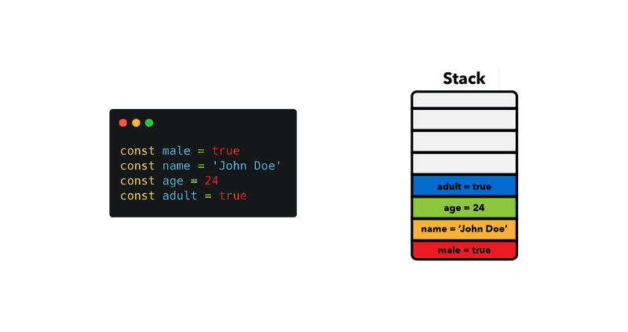
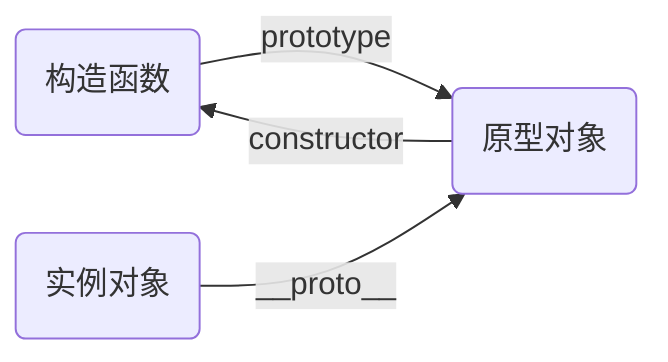

### 变量和原始值/引用值

变量和值保存在栈内存上，对象保存在堆内存上

变量是一个容器，保存着原始值或引用值

原始值直接放在容器里，引用值是一个记录着对象在堆内存中位置信息的指针




null相当于分配到一个容器（内存上某个位置），只是容器里没有装任何值

undefined表示压根连容器都没有

参考资料：https://felixgerschau.com/javascript-memory-management/

### 类型转换

① number类型转换

```javascript
alert( Number("   0123") ); // 123（空格和0会被忽略）
alert( Number("123z") ); // NaN（从字符串“读取”数字，读到 "z" 时出现错误）
alert( parseInt("123z") ); // 123，Number和parseInt的区别
alert( Number(undefined) ); // NaN
alert( Number(null) ); // 0
```

② boolean类型转换

直观上为“空”的值（如 `0`、空字符串、`null`、`undefined`、`void 0` 和 `NaN`）将变为 `false`。

其他值变成 `true`，包括`"0"`，`"{}"`

`void 0`：`value === void 0`相当于`value === undefined`，获取`undefined`值的表达式，因为`undefined`不是`JavaScript`关键字，可以被当成变量名赋值

### script

```js
<script defer src="example1.js"></script> 
// 立即下载，但延迟执行,执行顺序是代码写的顺序
<script async src="example2.js"></script> 
// 立即下载，但不必等下载和执行完后再加载页面，也不用等该文件下载和执行后再加载其他文件（执行顺序不一定是代码写的顺序），即下载好后立即运行，下载过程不影响其它文件的加载
```

## 函数

### 函数参数

函数参数是按值传递的，而不是按引用传递，传进来的值会被复制到一个局部变量中，该变量是`arguments`对象中的一个槽位，如果传递的是一个对象，那么实际传递的只是一个指向该对象所在位置的指针

### 防抖与节流

两者都是在某些场景下为了避免频繁请求接口

防抖：n秒后再执行，若在 n 秒内被重复触发，则重新计时，通常用于在即时搜索中对input输入进行防抖处理

节流：n秒内只执行一次，在n秒内重复触发，只有一次生效

## this

`this`永远指向的是一个对象，这个对象就是函数执行时所处的环境（即函数上下文），设计目的就是为了指代函数执行时的函数上下文

因为函数可以在多个地方被调用，`this`的指向在函数定义的时候是确定不了的，只有函数执行的时候才能确定`this`到底指向谁

`this`的绑定不基于函数调用栈（即父函数不能充当执行上下文）也不基于作用域链

```js
var a = 10;
function bar() {
    let a = 2;
    function foo() {
        let  a = 1;
        console.log(this.a);
    }
    foo();
}
bar(); // 10
 var a = 10;
 function foo() {
     let  a = 1;
     console.log(this.a);
 }
 function bar() {
     let a = 2;
     foo();
 }
 bar(); // 10
function App() {
    let a = 0;
    this.b = 0;
}
const app1 =new App();
console.log(app1.a); // undefined
console.log(app1.b); // 0
var a = 10;
function foo() {
    console.log(this.a);
}
const obj = {
    a: 1,
    foo,
}
foo(); // 10
obj.foo(); // 1
foo.call(obj); // 1
```

1、变量`a`和变量`foo`对应的原始值或引用值地址是保存在栈内存的，而函数`foo`和对象`obj`这些引用值是保存在堆内存的 2、直接执行`foo()`，就好比从`window`对象的变量`foo`中拿到函数`foo`的地址，然后去找到`foo`函数并执行它，函数执行的过程中需要用到`this`，这时候就需要你提供给它，告诉它，我是从`window`对象的变量里找到你地址的，那么函数打印出的就是`window`里的`a` 3、执行`obj.foo()`，也是一样，你是从`obj`里找到它地址的，你就告诉函数，函数就会把`this`绑定到`obj`对象上 4、`foo.call(obj)`就好比你直接告诉函数，你不要管我是从哪个对象找到你地址的，你直接把`this`绑定到`obj`这个对象里就行

### this的绑定顺序

```js
// 绑定顺序，判断绑定的规则
let bar = new foo(2); // 1、new绑定，绑定到foo()新创建的对象中
let bar = foo.call(obj1); // 2、通过call、apply(显式绑定)或bind(硬绑定)到指定对象obj1
let bar = obj2.foo(); // 3、在对象obj2中调用(隐式绑定)
let bar = foo(); // 4、默认绑定，非严格模式下绑定到全局对象，严格模式下绑定到undefined
```

### 箭头函数的this

在箭头函数中，`this`从定义它的函数继承

```js
function Button() {
    this.clicked = false;
    this.click = () => { // Button()的this指向谁，它就跟着指向谁
        this.clicked = true;
    };
}
```

### 匿名函数的this

匿名函数的执行环境具有全局性，所以`this`通常指向`window`对象

## 作用域链

作用域表示变量的可使用范围，本质是一个词法环境对象，作用域链则是由这些对象链接起来的对象链

每个函数被创建时，都会附带一个内部（隐藏）的词法环境对象，该对象存储函数的所有局部变量作为其属性（包括`this`的值），并且还能再引用外部的词法环境对象（如果有的话），其实就是把它被创建时能访问到的所有变量都放入一个隐藏对象里，以便之后它被执行的时候用

变量查找基于作用域链的，而不是基于调用栈，它只关注函数在何处声明，不关注函数在何处调用 函数找不到变量时，会去它的上一级作用域找，而不是去调用它的函数里找

作用域链的设计目的：保证变量和函数的有序访问

```js
var a = 10;
function foo() {
    console.log(a);
}
function bar() {
    let a = 20;
    foo();
}
bar(); // 10
var a = 10;
let fall;
function outerFun() {
    let a = 20;
    function innerFun() {
        console.log(a);
    };
    fall = innerFun; // 将innerFun的地址放进fall变量
}
outerFun(); // 调用outerFun函数，把它的内部函数innerFun创建出来
fall(); // 20
```

在第二个例子里，通过`fall`变量找到`innerFun`这个函数的地址并执行它，也就是说`innerFun`是在全局环境下执行的，但它不是打印出它所在的执行环境下的`a`（即`window.a`），而是它声明时得到的`a`

## 闭包

所有的函数在被创建时，会产生一个隐藏对象来保存它当时所能访问到的所有变量（即记住创建它们的词法环境），因为这个特性，实现了闭包

说白了，闭包就是能保存着它被创建时所能访问到的变量，以便之后它被调用时可以拿到变量来使用的函数

闭包变量的查找基于作用域链而不是调用栈，所以闭包函数里变量的取值和它被定义时所在的作用域有关

```js
var count = 10;
function makeCounter() {
    let count = 20;
    return function() { // 当makeCounter函数被调用时，该函数就被创建出来
// 它会生成一个内部(隐藏)的词法环境对象来存储这时它所能访问的所有变量
// 如果之后它被调用了，那么它找变量就从词法环境对象里找
// 就算它被调用的地方有同名变量，它还是使用的词法环境对象里的变量
        return count;
    }
}
const bbq = makeCounter(); // 拿到匿名内部函数的地址
console.log(bbq()); // 20
```

闭包保存的变量是动态的，也就是说，它声明时能访问到的变量发生改变，它执行时访问到的变量也是变化之后的

```js
function say() {    
    let num = 10;
    const sayHi = function() {
        console.log(num);
    }    
    num++;    
    return sayHi;
}
say()(); // 11
```

## 对象

### new Object () 、 {} 和null的区别

`new Object()`和`{}`各自都是一个独立的个体

```
null`是独一无二的，也不会被转换为`true
console.log(null === null); // true
console.log(Boolean(null)); // false
console.log(new Object() == new Object()); // false
console.log(Boolean(new Object())); // true
console.log({} == {}); // false
console.log(Boolean({})); // true
```

`new`一个对象的执行步骤

```js
function User(name) { 
    // this = {}; (隐式创建)
    this.name = name;
    // return this; (隐式返回)
}
```

### for...in与Object.keys

```js
let animal = {
  eats: true
};
let rabbit = {
  jumps: true,
  __proto__: animal
};
// Object.keys 只返回自己的 key
alert(Object.keys(rabbit)); // jumps
// for..in 会遍历自己以及继承的键
for(let key in rabbit) alert(key); // jumps，然后是 eats
```

## 原型链

### 设计目的

因为在 `JavaScript`中是没有类的概念的，为了实现类似继承的方式，让一个对象能访问另一个对象里面的属性和方法

通过 `__proto__`将实例对象和原型对象联系起来组成原型链，得以让实例对象可以访问到原型对象里面自己没有的属性或方法

`prototype`是函数特有的属性，`__proto__`是每个对象都有的属性



构造函数是为了给对象赋值特有属性和方法 原型对象是为了给对象提供共享属性和方法

设计原型链的目的：因为在 `JavaScript`中是没有类的概念的，为了实现类似继承的方式，通过 `_proto_`将实例对象和原型对象联系起来组成原型链，得以让实例对象可以访问到原型对象里面自己没有的属性或方法

```js
function Dog(name) {  // 构造函数
    this.name = name;
}
Dog.prototype.run = function() { // 原型对象里定义一个run方法，实例对象可以访问到
    console.log('狗会跑');
}
const dog1 = new Dog('小金'); // dog1，dog2是实例对象，通过构造函数赋予不同的名字
const dog2 = new Dog('小白');
dog1.run(); // 狗会跑 // dog1没有定义run方法，它的run方法是从原型对象那继承来的
```

实例对象虽然是构造函数创造出来的，但是它们之间并没有直接引用，实例实例之所以能用constructor属性访问到构造函数是因为这个属性是从它的原型对象继承来的

## 异步

`ES6`之前的异步编程方案：

```js
let x = 3
setTimeou(() => x = x + 4, 1000) // 下面的代码不知道什么时候能拿到更新后的x的值
...
```

拿到异步返回值

```js
function double(value, callback) {
    setTimeout(() => callback(value * 2), 1000) // 在值更新后把更新后的值当成参数传给回调函数调用
}
double(3, x => console.log(`value is ${x}`)) // 6
```

添加失败处理

```js
function double(value, success, failure) {
    setTimeout(() => {
        try {
            if (typeof value !== 'number') {
                throw 'Must provide number as argument';
            }
            success(value * 2)
        } catch (e) {
            failure(e)
        }
    }, 1000)
}
```

### Promise

`promise`对象用来连接`producing code`（生产者代码，通常要花费一些时间并拿到一个结果，例如调后端接口）和`consuming functions`（消费者函数，能拿到结果用来做一些其它事情）

```js
const promise = new Promise((resolve, reject)=>{});
// promise是这样的一个对象
{
    __proto__: Promise
    // 在 resolve 被调用时变为 "fulfilled"，或者在 reject 被调用时变为 "rejected"。
    [[PromiseState]]: "pending"
    // 在 resolve(value) 被调用时变为 value，或者在 reject(error) 被调用时变为 error
    [[PromiseResult]]: undefined // 保存成功的结果或失败的错误描述对象
}
// Promise是这样的一个对象
{
    then: ƒ then()
    catch: ƒ catch()
    finally: ƒ finally()
    constructor: ƒ Promise()
    Symbol(Symbol.toStringTag): "Promise"
    __proto__: Object
}
```

`state`和`result`都是私有属性，只能通过`.then`，`.catch`方法来访问

```js
const promise = new Promise((resolve, reject) => {
    setTimeout(() => resolve(123), 1000)
})
promise.then(result => {
    console.log(result)
})
```

## 事件机制

https://www.bilibili.com/video/BV1K4411D7Jb/?spm_id_from=333.337.search-card.all.click

`JavaScript`有一个调用栈和任务队列

```js
console.log('111');
setTimeout(() => {
    console.log('222');
}, 100);
console.log('333');
```

调用顺序：

1、调用栈执行打印111

2、碰到setTimeout，把它交给`webapis`接管，`webapis`会设置一个定时器，到了指定时间后将回调函数放入任务队列

3、调用栈执行打印333，然后调用栈空了，`js`引擎就把任务队列中列头的函数放到调用栈执行（只有调用栈为空才会去查看任务队列）

`JavaScript`包括同步代码和异步代码，异步代码又包括宏任务和微任务 宏任务包括：`script`、`setTimeout`、`setInterval`、`setImmediate` 微任务包括：`process.nextTick`、`Promise`，它们在执行上下文中都是同步代码，只不过会将各自的回调函数放入对应的宏任务队列或微任务队列中

`js`事件循环的执行机制是宏任务 => 同步代码 => 微任务

`promise`的回调函数是同步代码，因此发送`ajax`请求也属于同步代码，拿到结果后执行的回调函数才是微任务代码

```js
new Promise(function(resolve) {
    console.log('第一次循环主执行栈进行中...') // 同步代码
    resolve()
}).then(function() {
    console.log('第一次循环微任务，第一次循环结束') // 微任务代码
    setTimeout(function() { // 宏任务代码
        console.log('第二次循环的宏任务队列的第二个宏任务执行')
    })
})
```

## 使用技巧

① 方法只用到第二个参数

```js
this.$emit('select', selection, row) // 传递了两个参数
// 只用到第二个参数row，不需要第一个参数selection
handleSelect(...arg) // 方法1，用rest运算符，arg[1]就是row
handleSelect(_, row) // 方法2,用_来当占位符
```

② 测量耗时

```js
console.time('aa');
await this.reerection(mapDataList);
console.timeEnd('aa'); // aa: 64.576171875 ms
```

③ 转换类型

```js
!!value // 等同于Boolean(value)
+value // 等同于Number(value)
```

④ try-catch-finally执行顺序

1）无return

```text
try => finally 或者 try => catch => finally
```

2） 有return

原则：try-catch-finally只能执行一次return

```text
try中有return的话 执行到return前就跳到finally，finally执行完再回来执行try的return
try和finally都有return的话，在执行finally的return后就退出，不会再回去执行try的return
```

常用在点击确定按钮，发送表单时，服务器未响应前loading

```vue
<el-button v-loading="loading" @click="confirm">保存</el-button>
<scirpt>
    confirm() {
        try {
            this.loading = true;
        }.catch(e) {
            console.log(e);
        }.finally {
            this.loading = false;
        }
    }
</scirpt>
```

⑤  数字三位插一个逗号

```
Number(amount).toLocaleString()
```

⑥  提取url的参数为对象

```ts
const useQuery = () => {
    const params = location.search.slice(1)
    const query = params.split('&')
        .reduce((prev, item) => {
            const keys = item.split('=')
            const key = keys[0]
            prev[key] = window.decodeURIComponent(keys[1])
            return prev
        }, {})
    return query
}
```

⑦  新增或编辑传不传id

```ts
const params = {
    ....
    id: detailInfo.isEdit ? detailInfo.id : undefined
}
```

## JavaScript坑

### 打印的对象和打印对象属性值不一致

console.log为了性能，直接打印的不一定是当前值，展开的时候才会访问内存读取最新的

```js
console.log('数据详情id', this.supplier.canManQuote); // 值是初始值0
console.log('数据详情', this.supplier); // 不展开看到的canManQuote值是0，展开后看到是1
// 解决办法：展开查看或者debugger调试查看或JSON.stringify
console.log('数据详情', JSON.stringify(this.supplier))
```

## 正则表达式

https://c.runoob.com/front-end/854/

## 手写类

### 浅拷贝和深拷贝

浅拷贝

```js
// 递归遍历旧对象的值赋给新对象并返回
function shallowClone(obj) {
    const newObj = {};
    for(let prop in obj) {
        if(obj.hasOwnProperty(prop)) {
            newObj[prop] = obj[prop];
        }
    }
    return newObj;
}
// Object.assign()
const newObj = Object.assign({}, oldObj);
// 扩展运算符
const newObj = {...oldObj}
```

深拷贝

```js
// JSON.stringify()，会忽略undefined、symbol和函数
const oldObj = {
    name: 'A',
    name1: undefined,
    name3: function() {},
    name4: Symbol('A')
}
const newObj = JSON.parse(JSON.stringify(oldObj));
console.log(newObj); // {name: "A"}
// 循环递归
function deepClone(obj, hash = new WeakMap()) {
    if (obj = null) return obj;
    if (obj instanceof Date) return new Date(obj);
    if (obj instanceof RegExp) return new RegExp(obj);
    // 可能是对象或者普通的值，如果是函数的话是不需要深拷贝
    if (typeof obj !== "object") return obj;
    if (hash.get(obj)) return hash.get(obj)
    let cloneObj = new obj.constructor();
    hash.set(obj, cloneObj);
    for (let key in obj) {
        if (obj.hasOwnProperty(key)) {
            cloneObj[key] = deepClone(obj[key], hash);
        }
    }
    return cloneObj;
}
```
