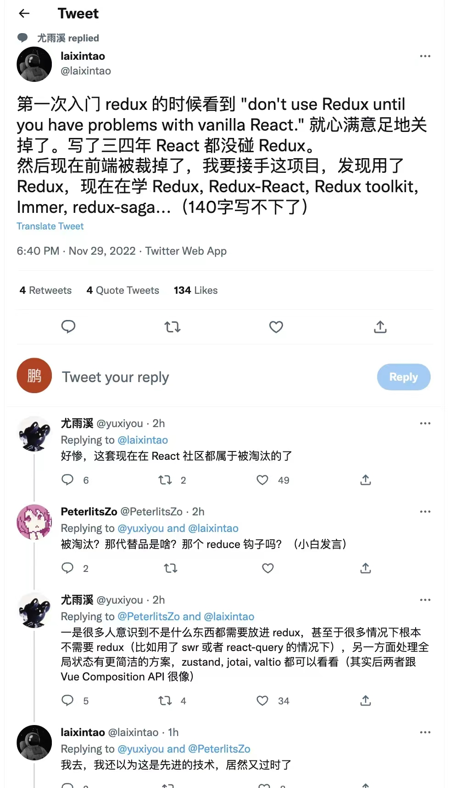

## Vuex

[官网](https://vuex.vuejs.org/zh/guide/)

[Pinia](https://pinia.web3doc.top/)

### mapState和mapGetters

```js
...mapState({
    supplier: state => state.fallback.supplier
})
...mapGetters([
    'supplier'  // supplier只在state里有，没有getter照样可以引进来
])
```

## React Redux

[参考资料](https://taro-docs.jd.com/taro/docs/redux/)


