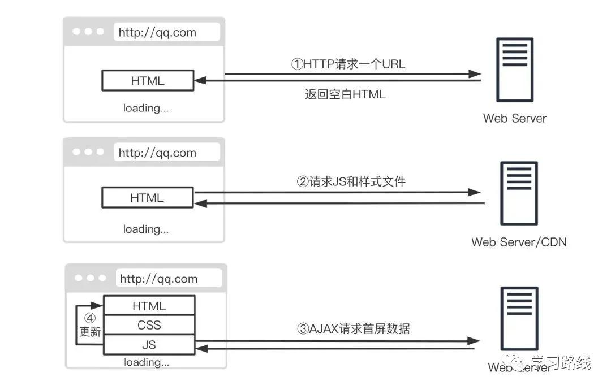
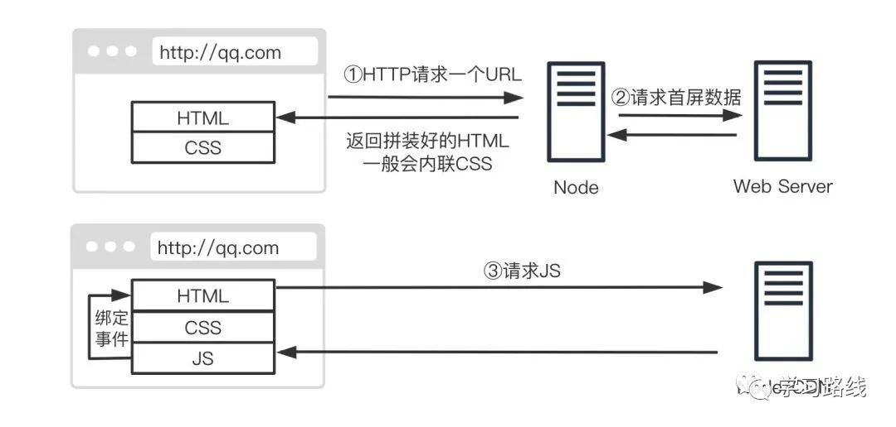

## 服务端渲染

`SPA`返回的是空`HTML`，所有`js`代码被打包成一个或多个文件，需要在一开始就加载所有的资源，因此会有几个缺点

1. 请求网页后白屏时间比传统网页长
2. 爬虫爬到的是空白页面，没办法做`SEO`
3. 业务复杂度高的情况下，请求文件大，渲染非常慢

区别

 


评价：同构渲染有它自己适用的场景，也有相应的缺点(工程上太麻烦了，性价比不高)，涉及到前端开发和维护成本，运维系统架构的规划，带来的首屏渲染速度和SEO提升可能并不明显

## Nuxt项目中遇到的坑

1、组件命名，components下组件名不能相同，导致所有不同页面的相同组件都要加一堆前缀或后缀

```js
├── components
│   ├── InventoryManagement
│   │   ├── tableColumns.js
│   ├── BlacklistManagement
│   │   └── tableColumns.js // 报两个文件名冲突
```

解决办法：取消自动引入组件（不确定是否有效）

2、所有发后端请求的都要用`try...catch`包着，不然会切换页面太频繁了会进500页 进页面就发后端请求的要用`this.$nextTick`包着，不然也会进500页（也有`$refs.xxx`为`undefined`等可能）

3、`keep-alive`不生效，所有组件都要注册`name`，`index.vue`的`export default class xxx`名要和文件夹名相同，更要和`components`相对应的文件夹名相同

4、`Cannot convert undefined or null to object`

搜索查到是因为`Object.keys(xxx)`，里面的参数为`null`或`undefined`

实际解决办法：删除掉`.nuxt`文件夹重新启动

###  其它记录

```js
searchForm: SearchForm[] = []
searachForm = [] as SearchForm[] // 两种写法没区别
@Ref() tableDom!: BaseTable
$refs!: {
    tableDom: BaseTable // 值是.vue文件名或者class名
}
// 两者没区别，$refs多了个提示功能
```

① 编译node-sass出错，不识别/deep/等语法

原因：sass-loader版本太高

```js
node-sass: ^5.0.0
sass-loader: ^10.0.5
切换成低版本： npm i sass-loader@7.0.3
```

② node-sass问题

```text
npm rebuild node-sass
```
