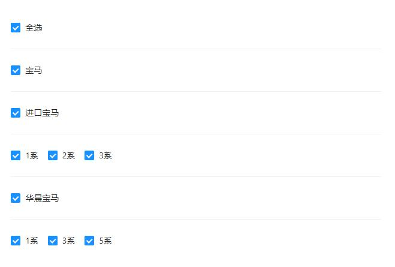

## Radio

更改`radio-button`的样式，无法从`radio-group`和`label`进行更改，只能对子元素的`span`修改

```vue
<hn-radio-group v-model="submitForm.auditResult" @change="clearValidate">
  <hn-radio :label="0">同意</hn-radio>
  <hn-radio :label="1" :disabled="!infoForm.allowAuditReject">拒绝</hn-radio>
</hn-radio-group>
```

表单校验的不是选没选， 而是绑定的值是否为空

## Input

所有的输入框加个`style="width: 100%"`，宽度等于`form`的宽度减去 `label`宽度

```css
<el-form class="width-form">
::v-deep .width-form {
  width: 330px;
}
```

`el-input`是对`input`的封装，可以设置初始值为`null`，清空输入时值为空字符串

```
el-input-number`初始值应该设置为`undefined`（设置`''`或`null`会被自动转成`0`），清空输入时值为`undefined
```

最简`el-input`封装，在此之上添加想要的功能

```vue
<template>
    <el-input
        ref="input"
        :value="currentValue"
        v-bind="$attrs"
        v-on="$listeners">
    </el-input>
</template>
<script>
export default {
  name: 'TestInput',
  props: {
    value: {}, // 默认undefined
  },
  data() {
    return {
      currentValue: '',
    }
  },
  watch: {
    value: {
      immediate: true,
      handler(value) {
        this.currentValue = value;
      }
    }
  }
};
</script>
```

① 限制输入数字

```vue
<el-input v-model="phone" oninput="value=value.replace(/[^\d]/g,'')" />
<el-input v-model="submitForm.phone" oninput="value=value.replace(/\D/g,'')" />
<el-input v-model="submitForm.phone" oninput="value=value.replace(/\D,'')" />
// 加g和不加g的区别：输入时非数字输入都无效，但复制粘贴时加g可自动剔除非数字部分，不加g只剔除第一个非数字部分
// 限制输入正整数
<el-input oninput="value = value.replace(/^0|\D*$/g,'')" />
```

② `width`为1px的用处

```scss
.el-input-group__append, .el-input-group__prepend {
    display: table-cell; // 父级div是inline-table
    padding: 0 20px;
    width: 1px; // 设置width为1px，让宽度由里面内容和padding撑开
}
```

③ 初始值不能保留小数点后的0

```js
<el-input v-model="form.num" />
form = {
    num: 10.00
}
页面输入框只会显示10
原因：form.num对应input.vue里面的nativeInputValue
value不能为数字，要改成字符串
String(10.00) // 10
String('10.00') // 10.00
```

③ autocomplete的选择

过滤数据放在前端还是后端：数量量少可放在前端，数据量大会增加前端渲染压力，因此放在后端

和select开启filtelable的区别：

1、autocomplete的v-model绑定的item属性是value-key的值，显示什么，绑定的值就是什么（二封装组件可以做转化）

2、select输入值匹配不到会自动清空，autocomplete则不会

## Select

修改下拉选项的宽度

```css
:popper-append-to-body="false" // 不让下拉框插入到body中而是作为select的子元素
::v-deep .el-select-dropdown {
    width: 280px;
}
```

## Upload

①  一般上传图片都会封装成公共组件，原先的el-upload组件缺少校验

解决方法：加一个绑定相同值并且隐藏的el-input

```vue
 <hn-form-item
          label="图片:"
          prop="imgUrls">
     <hn-input
          v-model="detailParams.imgUrls"
          style="display: none" />
     <upload-pic
           v-model="detailParams.imgUrls"
           :limit="1"
           :disabled="disabledEdit" />
</hn-form-item>
<sciprt>
    formRules: {
   		imgUrls: [{ required: true, message: '请选择图片', trigger: 'change' }],
    },
</sciprt>
```

②  启用多选时第一次多选时只能选一张

报错：TypeError: Cannot set properties of null (setting 'status')

搜索解释是fileList不允许修改

```tsx
 @Watch('value', { immediate: true })
  onValueChange (newValue: any[]) {
    const Realval = newValue.filter(i => !!i);
    this.exposureOut = Realval;
    if (Realval && Realval.length > 0 && this.fileList.length === 0) {
      for (let i = 0; i < Realval.length; i++) {
        this.fileList.push({
          url: Realval[i]
        });
      }
    } else if (!Realval.length) {
      this.fileList = [];
    }
  }
// 解决办法：在success回调中赋一下fileList的值就可以了
onSuccess(response:any, file: {name: string, [propname: string]: string}, fileList: any) {
    ...
    this.fileList = fileList
    ...
}
```


## Form

① `this.$res.form.resetFields()`的前置条件

```js
// <el-form>加ref属性 model属性
// 为每个form-item设置prop值,并且要与rules的名称、绑定数据的名称一样 v-model=form.xxx
```

② `form`赋初始属性，不能为`{}`，为空时在编辑回显的时候触发了校验规则，但是找不到`form.name`这个属性就会报错

③ 如果校验的`trigger`是`change`，在回显的时候如果传的是空值或空字符串等就会触发验证报错，解决办法：在赋值的时候把第一次校验清除掉

```js
this.$nextTick(() => {
	this.$refs.form.clearValidate()
});
```

④ 回显赋值问题：如果新增弹框和编辑弹框是同一个，并且编辑弹框回显`form`的回显赋值是`this.form.xxx = row.xxx`，关闭编辑弹框时，`resetFields`重置的值是回显值，而不是初始值，解决办法：

```js
 init(row) {
      this.visible = true;
      if (row) {
        this.$nextTick(() => {  // 回显赋值要包在nextTick里，重置的值才可以是初始值
          this.form.name = row.name
          this.form.addr = row.addr
          this.form.age = row.age
          this.form.birth = row.birth
          this.form.sex = row.sex
        })
     	// this.form = Object.assign({}, row) 也可以直接用这两个办法拷贝对象，效果相同
        // this.form = { ...row } 
        this.path = '/user/updateUser'
      }
    },
```

⑤ `form`和`form-item`之间可以隔着其它标签、`form-item`和表单项之间也可以隔着其它标签，只要最外层是用`form`包着，`resetFields`、`validate`等方法就可以生效

⑥ 自定义校验

```js
validateDeductionOrder = (_rule: object, value: number, callback: Function) => {
    if (value < 0) {
      callback(new Error('扣减顺序不能为负数'));
    } else {
      callback();
    }
  };
rules = {
 	...
    deductionOrder: [
      { validator: this.validateDeductionOrder, trigger: 'blur' }
    ]
  }
```

注意点：debugger时，this是指向第一个参数`_rule`的，并不影响校验

⑦ 在只允许输入数字的输入框中，校验方式要去掉`blur`

```vue
<hn-form-item label="质保期（月）:" prop="guaranteePeriod">
   <hn-input v-model="submitForm.guaranteePeriod" oninput="value=value.replace(/\D/g,'')" placeholder="请输入质保期" />
</hn-form-item>
rules = {
	guaranteePeriod: [
      { required: true, message: '请输入必填项' } // 没去掉的话即使输完数字失焦后还是会校验成没填
    ],
} 
```

⑧ 不想change或blur就触发校验，而是点了确定按钮才触发校验

```js
factoryType: [ // 如果是select组件，可以设置blur（也可以像input组件一样随便设置字符串）
      { required: true, message: '请输入必填项', trigger: 'blur' }
],
originMatched: [ // 如果是input组件，则设置除blur和change外的任意字符串（最好语义化一些，比如off）
      { required: true, message: '请输入必填项', trigger: 'off' }
],
```

⑨ 点击按钮多次提交表单问题

```vue
<el-button :loading="loading" @click="confirm">确认</el-button>
<script>
// 一开始写法，表单校验在try语句块里面，快速点击还是会提交两次
// 不管this.loading = true放在哪，或者加 if (this.loading) { return; } 都不生效，因为执行到await后没等返回结果就先去执行finally了
confirm () {
    this.loading = true;
    try {
      (this.$refs.formDom as any).validate(async (valid: boolean) => {
        if (!valid) { return; }
        const res = await ReturnGoodsApi.checkReceive(this.submitForm);
        if (res.success) {
          this.$emit('refresh');
          this.$message.success('操作成功');
          this.close();
        } else {
          this.$message.error(res.message);
        }
      });
    } catch (error) {
      this.$nuxt.context.error(error);
    } finally {
      this.loading = false;
    }
  }
// 要把表单校验放到外面才能生效，原因是try...catch不会管try语句块里面的异步代码，当执行完异步代码时，js引擎已经离开try...catch语句块
confirm () {
    (this.$refs.formDom as any).validate(async (valid: boolean) => {
      if (!valid) { return; }
      this.loading = true;
      try {
        const res = await ReturnGoodsApi.checkReceive(this.form);
        if (res.success) {
          this.$emit('refresh');
          this.$message.success('操作成功');
          this.close();
        } else {
          this.$message.error(res.message || '');
        }
      } catch (error) {
        this.$nuxt.context.error(error);
      } finally {
        this.loading = false;
      }
    });
  }
</script>
```

## Table

① 表格数据过滤，例如将后端返回的`0`和`1`，转换成男和女

方法1：单独封装一列类型为`formatter`的列，表示对数据做转化

```vue
// 封装的表格组件中
<el-table-column
    v-else-if="type === 'formatter'"
    :formatter="formatterMethods" />
<script lang="ts">
 @Prop() formatterFun?: Function; // 过滤函数
 formatterMethods (row:any, column:any) {
    if (typeof this.formatterFun === 'function') {
      return this.formatterFun(row);
    }
    const nums = parseFloat(row[column.property] || 0).toFixed(2);
    return nums.toString().replace(/(\d)(?=(\d{3})+\.)/g, '$1,');
  }
</script>
// tableColumns中
 {
    title: '性别',
    name: 'sex',
    type: 'formatter',
    formatterFun (row) {
		return row.sex ? '女' : '男'
   	}
  },
```

方法2：还是在类型为`slot`的列上做操作，过滤方法由页面组件定义

```vue
// tableColumns中
 {
    title: '性别',
    name: 'sex',
    slotName: 'sex'
  },
// 页面组件中
<base-table ref="tableDom" ...>
    <template #sex="{ row }">
		{{ row.sex | filterSex }}
    </template>
</base-table>
<script lang="ts">
@Component({
  // Vue3删除filters，可改用computed或methods代替
  filters: {
    filterSex (value: number): string {
      return value ? '女' : '男';
    }
  }
})
</script>
```

② 新增、编辑、查看操作，只有新增不需要传表格行数据的`id`，这时候`id`就可以传`null`, `undefined`, `0` 或者空字符串这些`falsy`值来代替

③ 有时宽度太宽，用`flex`影响不到

解决办法：设置width: 0

④ sortable和el-table 结合

bug描述：elementui有图片列，当拖拽顺序后，点击放大图片的遮蔽层宽高会被限制在当前行的宽高里

原因：拖拽行后，当前行会被设置style="transform: translateZ(0px)"

tanslateZ可以开启gpu加速，提高浏览器渲染的性能

解决办法：在初始化拖拽表格的onEnd事件里清掉

```js
onEnd: async evt => {
    evt.item.style.cssText = '';
    ....
}
```

## Dialog

① 点编辑时，更改值后再重置，会默认新的值作为初始值，解决办法，等`dialog`初始化后再赋值

```js
this.$nextTick(() => {
    this.form.xxx = xxx;
})
```

② 弹窗关闭时表单重置为初始值

`Dialog`内部使用的是`v-show`来控制弹窗显示隐藏，所以弹窗关闭时不会自动清空表单

踩坑：用`v-if`控制，`v-if`销毁的是组件，不销毁数据，所以还是要从`form`入手

```js
this.$refs.form.resetFields(); //  方法1
data: cloneForm: { ...this.form } // 方法2
methods: this.form = this.cloneForm
```

③ 弹框表单宽度

使用时统一`labelWidth`，在`el-form`标签上定义

```text
form宽度 = label宽度 + 输入框宽度
```

④ 子组件是弹框的两种使用方法

方法1，使用`ref`

```js
// 父组件
template: <child-dialog ref="childDialogDom"/> 
methods: this.$refs.childDialogDom.open()
// 子组件
template: <base-dialog :visible=visible> // visible是data里的
init() {
    this.visible = true
}
```

方法2，使用`prop`、`emit`

```js
// 父组件
template: <child-dialog :visible.sync="visible"/>
methods: this.visible = true
// 子组件
template: <base-dialog :visible.sync="visible"/> // visible是props里的
props: visible: Boolean
methods: close() { this.$emit('update:visible', false) }
```

⑤ 一个页面组件中打开很多个弹框

如果打开弹框的方法是通过`this.$refs.xxxDom.open()`，那么可以统一到一个`openDialog`方法里

```vue
<el-button @click=openDialog('add')></el-button>
<el-button @click=openDialog('edit')></el-button>
<script lang="ts">
    openDialog(val: string) {
        switch(val) {
            case 'add':
                this.$refs.addDom.open(); break;
            case 'edit':
             	this.$refs.editDom.open(); break;
        }
    }
</script>
```

## 逆向可编辑表格

需求背景：表格数据逆向展示，第一列的类别和指标是静态展示的，后面的列名为日期的列是根据表单查询的日期值（最多可查询30天），也就是最多有30列动态生成的列，并且支持点击编辑能修改一整行的数据

```ts
// 后端返回的数据结构
{
  "model": [
    {
      "id": 0,
      "manageAnalysisId": 0,
      "payDate": "",
      "sectionDate": "2022-08-20",
      "supplierId": 0,
      "carBrand": "",
      "inqcnt": 0,
      "inqdetcnt": 0,
      "codeInqdetcnt": 0,
      "quoinqcnt": 0,
      "valueQuoinqcnt": 0,
      "codeQuoinqcnt": 0,
      "fullautoQuoinqcnt": 0,
      "fullmanQuoinqcnt": 0,
      "originalQuoinqcnt": 0,
      "originalPtinqcnt": 0,
      "thatdayPtinqcnt": 0,
      "odtcnt": 0,
      "thatdayptOdtcnt": 0,
      "thatdayptPayOdtcnt": 0,
      "autoOdtcnt": 0,
      "supmanQuoteduration": 0.0,
      "batchinqcnt": 0,
      "purchOdcnt": 0,
      "purchOddetcnt": 0,
      "skucnt": 0,
      "purchAmount": 0.0,
      "rgsuperrnum": 0,
      "exsuperrnum": 0,
      "manInqdetcnt": 0,
      "manOdtcnt": 0,
      "quobackupInqdetcnt": 0,
      "quobackupQuoinqcnt": 0,
      "quobackupOdtcnt": 0,
      "autoQuoinqcnt": 0,
      "manQuoinqcnt": 0
    },
    { "sectionDate": "2022-08-21", ... },
    { "sectionDate": "2022-08-22", ... },
    ...
  ],
  "success": true,
  "errorCode": "",
  "errorMsg": ""
}
```

初期解决办法：

根据表单值生成30个日期列（可选时间范围为30天）

```ts
insertDaysColumns(beginDate, endDate) {
      const beginYear = beginDate.slice(0, 4); // 2021-10-18, 取年份2021
      const beginMonth = beginDate.slice(5, 7); // 2021-10-18, 取月份10
      const beginDay = beginDate.slice(8, 10); // 2021-10-18, 取日期18
      const endYear = endDate.slice(0, 4); // 2021-11-18, 取年份2021
      const endMonth = endDate.slice(5, 7); // 2021-11-18, 取月份11
      const endDay = endDate.slice(8, 10); // 2021-11-18, 取月份18
      const beginArr = [];
      const endArr = [];
      if (beginMonth !== endMonth) { // 如果是10月和11月的话
        const beginDays = this.getDays(beginMonth); // 10月最多几天
        for (let i = beginDay; i <= beginDays; i++) {
          beginArr.push(`${beginYear}-${beginMonth}-${i}`);
        }
        for (let i = 1; i <= endDay; i++) {
          endArr.push(`${endYear}-${endMonth}-${i}`);
        }
      } else { // 同一个月
        for (let i = beginDay; i <= endDay; i++) {
          beginArr.push(`${beginYear}-${beginMonth}-${i}`);
        }
      }
      this.daysColumns = [...beginArr, ...endArr].map(item => ({
        label: item,
        prop: item,
        minWidth: 100,
        scopedSlot: item,
      }));
      this.searchObj.columns = this.columns.slice(0, 2).concat(this.daysColumns).concat(this.columns[2]);
    },
```

二次完善：后端说列名为日期的是根据后端返回来的model数据生成的，因为可能30天只有5天有数据，就不要空着25列，并把26个指标值添到对应的列中

```ts
// 在query方法获取表格数据后进行转化并生成动态列插入
  async onQuery(reset = true) {
      try {
        reset && this.$refs.bpTable.resetPageParams();
        const res = await this.$Post(API.manageAnalysis.queryDetail, this.searchObj.queryParams);
        const data = res.model || [];
        this.searchObj.list = this.transformData(data);
      } catch (error) {
        this.loading = false;
      }
  },
 transformData(model) {
      const newModel = [];
      model.forEach(item => { // 先把日期值由时间戳转成要的格式
        item.sectionDate = formatDate(item.sectionDate, this.searchObj.queryParams.unit === 1 ? 'yyyy-MM-dd' : 'yyyy-MM');
      });
      this.daysColumns = model.map((item, index) => ({
        label: item.sectionDate,
        prop: item.sectionDate,
        minWidth: 100,
        index, // index是必须的，具体原因不明
        dynamic: true,
      }));
      for (let i = 0; i < this.argumentsArr.length; i++) {
         newModel.push({
           class: i < 22 ? '交易' : '采购入库',
           indicator: this.tradeArr[i],
           edit: false,
         });
      }
      this.argumentsArr.forEach((item, index) => {
        this.daysColumns.forEach(item1 => {
          newModel[index][item1.prop] = model[item1.index][item];
        });
      });
      this.searchObj.columns = this.columns.slice(0, 2).concat(this.daysColumns).concat(this.columns[2]);
      return newModel;
    },
```

```ts
// 公共表格
 <bp-table
        ref="bpTable"
        row-key="id"
        row-class-name="draggable"
        :max-height="550"
        :columns="searchObj.columns"
        :table-data="searchObj.list"
        @changePagination="onQuery(false)">
        <template // 直接用default去接收，因为列名是动态的，所以插槽名一定要固定
          #default="{ row, dynamicName }">
          <hn-input
            v-if="searchObj.queryParams.unit === 1 && row.edit"
            v-model="row[dynamicName]" />
          <span v-else>{{ row[dynamicName] }}</span>
        </template>
</bp-table>
// bp-table.vue中
<hn-table-column
            v-for="(item, index) in columns"
            :key="index"
            :align="item.align"
            :label="item.label"
            :min-width="item.minWidth"
            :fixed="item.fixed"
            :width="item.width">
    <template slot-scope="scope">
			<!-- 用于动态列，列名不固定的情况-->
              <slot
                v-if="item.dynamic"
                :row="scope.row"
                :dynamic-name="item.prop" /> // prop既是列名也是对应的值
              <div v-else-if="item.scopedSlot">
                <slot
                  :name="item.scopedSlot"
                  :row="scope.row" />
              </div>
    </template>
</hn-table-column>
```

```ts
// 编辑行时，后端要求传回的数据格式是这样  每一列都有对应的id和值，fieldName是指标值，每一行的指标值的固定不变的
{
  "fieldName": "",
  "manageAnalysisUpdateValueDTOList": [
    {
      "manageAnalysisDetailId": 0,
      "fieldValue": ""
    }
  ]
}
```

```ts
async save(row) {
      row.edit = false;
      const obj = {};
      obj.fieldName = this.argumentsArr[this.tradeArr.findIndex(item => item === row.indicator)];
      obj.manageAnalysisUpdateValueDTOList = [];
      this.daysColumns.forEach(item => {
        if (Object.hasOwnProperty.call(row, item.prop)) {
          obj.manageAnalysisUpdateValueDTOList.push({
            manageAnalysisDetailId: item.id,
            fieldValue: row[item.prop],
          });
        }
      });
      try {
        const res = await this.$Post(API.manageAnalysis.updateDetail, obj);
        if (res.success) {
          this.$message.success('保存成功');
        } else {
          this.$message.error(res.message);
        }
      } catch (e) {
        console.log(e);
      }
    },
```

## 四层多选框

需求背景：选中车品牌（可选多个，示例图只选了宝马）后会展示所选的一个或多个车品牌下所属的子品牌及子品牌下对应的车系，级联选择器有类似的功能，但是级联选择器只有三级，而且展示效果不如列出来的多选框直观

第一级勾选框：勾选所有车品牌  
第二级勾选框：勾选车品牌下所有子品牌  
第三级勾选框：勾选子品牌下所有车系  
第四级勾选框：勾选单个车系

难点1：勾选哪一层都要对应去做它的上层或下层的勾选逻辑  
难点2：传给后端是carBrandDTOS、carSubBrandDTOS、carSystemDTOS三个参数，如果选了车系，再全选了子品牌，那么车系carSystemDTOS要清空，其它同理  
难点3：部分子品牌或车系已被添加过，但是依然要展示出来，此时会设置成禁用状态，逻辑要绕开这些禁用的

示例图



```ts
const carBrandModule = {
  state: {
    carBrandDTOS: [], // 供应商车品牌对象数组
    carSubBrandDTOS: [], // 供应商车子品牌对象数组
    carSystemDTOS: [], // 供应商中车系对象数组
  },
  mutations: {
      setCarBrandDTOS: (state, result) => {
          if (typeof result === 'number') {
            // 只传brandId，说明是要删除
            state.carBrandDTOS = state.carBrandDTOS.filter(item => item.brandId !== result);
          } else {
            state.carBrandDTOS = state.carBrandDTOS.concat(result);
          }
      },
      setCarSubBrandDTOS: (state, result) => {
          if (typeof result === 'number') {
            // 只传brandId，说明要删除该车品牌下全部子品牌
            state.carSubBrandDTOS = state.carSubBrandDTOS.filter(item => item.carBrandId !== result);
          } else if (Array.isArray(result) && typeof result[0] === 'string') {
            // 传的是[子品牌名, 车品牌id]，说明要删除该车品牌下的某个子品牌
            const middleList = state.carSubBrandDTOS.filter(item => item.carBrandId !== result[1]);
            // 当前车品牌下的
            const currentList = state.carSubBrandDTOS.filter(item => item.carBrandId === result[1]);
            state.carSubBrandDTOS = currentList.filter(item => 
                  item.carSubBrandName !== result[0]).concat(middleList);
          } else {
            state.carSubBrandDTOS = state.carSubBrandDTOS.concat(result);
          }
    },
    setCarSystemDTOS: (state, result) => {
      if (typeof result === 'number') {
        // 只传brandId，说明是要删除
        state.carSystemDTOS = state.carSystemDTOS.filter(item => item.brandId !== result);
      } else if (Array.isArray(result) && typeof result[0] === 'string') {
        // 传的是[子品牌名, 车品牌id]，说明要删除该车品牌下的某个子品牌
        const middleList = state.carSystemDTOS.filter(item => item.brandId !== result[1]);
        const currentList = state.carSystemDTOS.filter(item => item.brandId === result[1]); // 当前车品牌下的
        state.carSystemDTOS = currentList.filter(item => item.btrSubBrand !== result[0]).concat(middleList);
      } else {
        state.carSystemDTOS = state.carSystemDTOS.concat(result);
      }
    },
  }
}
```

```vue
<template>
  <el-dialog
    width="50%"
    :visible.sync="visible"
    :before-close="cancel">
    <div class="dialog-title">
      车系选择
    </div>
    <div class="dialog-body">
      <el-checkbox
        v-model="checkAll"
        :indeterminate="isIndeterminate"
        :disabled="disabled"
        @change="handleCheckAllChange($event)">
        全选
      </el-checkbox>
      <div style="margin: 15px 0;" />
      <div
        v-for="(brand, brandIndex) in allBrandObj"
        :key="brand.carBrandId"
        class="brand">
        <div style="padding: 5px 10px;">
          <el-checkbox
            v-model="brand.checkAll"
            :indeterminate="brand.isIndeterminate"
            :disabled="brand.disabled"
            @change="handleBrandCheckAll($event, brand, brandIndex)">
            <span class="brandName">{{ brand.carBrandName }}</span>
          </el-checkbox>
        </div>
        <div
          v-for="(subBrand, subBrandIndex) in brand.carSubBrandInfo"
          :key="subBrandIndex"
          class="group">
          <div style="background: #f5f5f5;padding: 5px 10px;">
            <el-checkbox
              v-model="subBrand.checkAll"
              :indeterminate="subBrand.isIndeterminate"
              :disabled="subBrand.disabled"
              @change="handleSubBrandCheckAll($event, subBrand, subBrandIndex, brand, brandIndex)">
              {{ subBrand.btrSubBrand }}
            </el-checkbox>
          </div>
          <el-row style="padding: 5px 10px;">
            <el-checkbox-group
              v-model="checkedCarSystemListIds"
              @change="handleCheckedCarSystemListChange">
              <el-checkbox
                v-for="carSystem in subBrand.carSystemInfo"
                :key="carSystem.carSystemID"
                :disabled="carSystem.isChecked"
                :label="carSystem.carSystemID">
                {{ carSystem.carSystemName }}
              </el-checkbox>
            </el-checkbox-group>
          </el-row>
        </div>
      </div>
    </div>
    <div
      slot="footer"
      class="dialog-footer">
      <hn-button
        size="small"
        type="primary"
        @click="ensure">
        确定
      </hn-button>
      <hn-button @click="cancel">
        取 消
      </hn-button>
    </div>
  </hn-dialog>
</template>
<script>
import API from 'Apis/apiList';
import { mapGetters } from 'vuex';

export default {
  props: {
    visible: { type: Boolean, default: false },
    brandIds: { type: Array, default: () => [] },
    regionIds: { type: Array, default: () => [] },
    groupId: { type: Number, default: null },
  },
  data() {
    return {
      checkAll: false,
      isIndeterminate: false,
      disabled: false,
      actualCheckAll: false, // 实际是否全选，用来传值时做判断
      checkedCarSystemListIds: [], // 选中的id数组，对象数组回显不了
      checkedCarSystemList: [], // 选中的对象数组，要存储和传给后端的
      allBrandObj: [], // 所有子品牌的
      allCarSystemList: [], // 单个子品牌的对象数组
    };
  },
  computed: {
    ...mapGetters([
      'carBrandDTOS',
      'carSubBrandDTOS',
      'carSystemDTOS',
      'carBrandSystemList',
    ]),
  },
  created() {
    this.getCarSystems();
  },
  methods: {
    handleCheckAllChange($event) {
      if ($event) {
        this.checkedCarSystemList = this.allCarSystemList.filter(item => !item.isChecked);
        this.checkedCarSystemListIds = this.checkedCarSystemList.map(item => item.carSystemID);
      } else {
        this.checkedCarSystemList = [];
        this.checkedCarSystemListIds = [];
      }
      this.setCheckAll();
    },
    handleBrandCheckAll($event, brand, index) {
      this.checkedCarSystemList = this.checkedCarSystemList.filter(item => item.brandId !== brand.carBrandId);
      if ($event) {
        let checkedArr = []; // 可选的长度
        this.allBrandObj[index].carSubBrandInfo.forEach(carSystem => {
          checkedArr = checkedArr.concat(carSystem.carSystemInfo.filter(item => !item.isChecked));
        });
        this.checkedCarSystemList = this.checkedCarSystemList.concat(checkedArr);
      }
      this.checkedCarSystemListIds = this.checkedCarSystemList.map(item => item.carSystemID);
      this.setCheckAll();
    },
    handleSubBrandCheckAll($event, subBrand, subBrandIndex, brand, brandIndex) {
      // 区别不同车品牌下存在相同名称的子品牌，把别的id的先过滤出来
      const middleList = this.checkedCarSystemList.filter(item => item.brandId !== brand.carBrandId);
      const currentList = this.checkedCarSystemList.filter(item => item.brandId === brand.carBrandId); // 当前车品牌下的
      this.checkedCarSystemList = currentList.filter(item => item.btrSubBrand !== subBrand.btrSubBrand).concat(middleList);
      if ($event) {
        this.checkedCarSystemList = this.checkedCarSystemList.concat(this.allBrandObj[brandIndex].carSubBrandInfo[subBrandIndex].carSystemInfo.filter(item => !item.isChecked));
      }
      this.checkedCarSystemListIds = this.checkedCarSystemList.map(item => item.carSystemID);
      this.setCheckAll();
    },
    handleCheckedCarSystemListChange() {
      this.checkedCarSystemList = this.allCarSystemList.filter(item => this.checkedCarSystemListIds.includes(item.carSystemID));
      this.setCheckAll();
    },
    getCarSystems() {
      const params = {
        brandIds: this.brandIds,
        regionIds: this.regionIds,
      };
      if (this.groupId) {
        params.groupId = this.groupId;
      } else {
        delete params.groupId;
      }
      this.$Post(
        API.coreSupplierManagement.queryCarSystemInfo,
        { ...params },
      ).then(data => {
        if (data.success) {
          this.allCarSystemList = [];
          data.model.forEach(brand => {
            const carSubBrandInfo = [];
            Object.values(brand.carSubBrandInfo).forEach(item => {
              carSubBrandInfo.push({
                btrSubBrand: item[0].btrSubBrand,
                carSystemInfo: item,
                checkAll: false,
                isIndeterminate: false,
                disabled: false,
                actualCheckAll: false,
              });
              this.allCarSystemList = this.allCarSystemList.concat(item);
            });
            this.allBrandObj.push({
              carBrandId: brand.carBrandId,
              carBrandName: brand.carBrandName,
              carSubBrandInfo,
              checkAll: false,
              isIndeterminate: false,
              disabled: false,
              actualCheckAll: false,
            });
          });
          this.setDisabled();
          this.setSelected();
        }
      });
    },
    ensure() {
      if (!this.checkedCarSystemList.length) {
        this.brandIds.forEach(brandId => this.$store.dispatch('delCarBrand', brandId));
        this.brandIds.forEach(brandId => this.$store.dispatch('setCarBrandDTOS', brandId));
        this.brandIds.forEach(brandId => this.$store.dispatch('setCarSystemDTOS', brandId));
        this.cancel();
        return;
      }
      // addCarBrand：添加车品牌或车系对象数组 delCarBrand：传brandId删除该车品牌
      // setCarBrandDTOS、setCarSubBrandDTOS、setCarSystemDTOS用法相同，传车品牌id，车子品牌名或车系id是删除，传对象数组是与旧的合并
      // 都是先删后加,addCarBrand可能不用
      this.allBrandObj.forEach(brand => {
        if (brand.actualCheckAll) {
          this.$store.dispatch('addCarBrand', [{
            brandId: brand.carBrandId,
            brandName: brand.carBrandName,
            btrSubBrand: '全车子品牌',
            carSystemID: -1,
            carSystemName: '全车系',
          }]);
          this.$store.dispatch('setCarBrandDTOS', brand.carBrandId);
          this.$store.dispatch('setCarBrandDTOS', [{
            brandId: brand.carBrandId,
            brandName: brand.carBrandName,
          }]);
          this.$store.dispatch('setCarSubBrandDTOS', brand.carBrandId);
          this.$store.dispatch('setCarSystemDTOS', brand.carBrandId);
        } else {
          this.$store.dispatch('delCarBrand', brand.carBrandId);
          if (this.checkedCarSystemList.filter(item => item.brandId === brand.carBrandId).length) {
            this.$store.dispatch('addCarBrand', this.checkedCarSystemList.filter(item => item.brandId === brand.carBrandId));
          }
          brand.carSubBrandInfo.forEach(subBrand => {
            this.$store.dispatch('setCarBrandDTOS', brand.carBrandId);
            this.$store.dispatch('setCarSubBrandDTOS', [subBrand.btrSubBrand, brand.carBrandId]);
            this.$store.dispatch('setCarSystemDTOS', [subBrand.btrSubBrand, brand.carBrandId]);
            if (subBrand.actualCheckAll) {
              this.$store.dispatch('setCarSubBrandDTOS', [{
                carBrandId: subBrand.carSystemInfo[0].brandId,
                carBrandName: subBrand.carSystemInfo[0].brandName,
                carSubBrandName: subBrand.carSystemInfo[0].btrSubBrand,
              }]);
            } else {
              const middleList = this.checkedCarSystemList.filter(item => item.brandId === brand.carBrandId);
              this.$store.dispatch('setCarSystemDTOS', middleList.filter(item => item.btrSubBrand === subBrand.btrSubBrand));
            }
          });
        }
      });
      console.log('车品牌', this.carBrandDTOS);
      console.log('车子品牌', this.carSubBrandDTOS);
      console.log('车系', this.carSystemDTOS);
      this.cancel();
    },
    cancel() {
      this.checkAll = false;
      this.isIndeterminate = true;
      this.allCarSystemList = [];
      this.allBrandObj = [];
      this.checkedCarSystemList = [];
      this.checkedCarSystemListIds = [];
      this.$emit('update:visible', false);
      this.$emit('cancel');
    },
    // 存在有禁用的就要除掉全选，点击那里就不做判断
    setCheckAll() {
      let brandCheckAll = 0;
      let brandActualCheckAll = 0;
      this.allBrandObj.forEach(brand => {
        let subBrandCheckAll = 0;
        let subBrandActualCheckAll = 0;
        brand.carSubBrandInfo.forEach(subBrand => {
          const currentList = this.checkedCarSystemList.filter(item => item.brandId === brand.carBrandId);
          const checkedSubBrandArr = currentList.filter(item => item.btrSubBrand === subBrand.btrSubBrand).length;
          if (subBrand.carSystemInfo.some(item => item.isChecked)) {
            subBrand.checkAll = checkedSubBrandArr && checkedSubBrandArr === subBrand.carSystemInfo.filter(item => !item.isChecked).length;
            subBrand.actualCheckAll = false;
            subBrand.isIndeterminate = checkedSubBrandArr > 0 && checkedSubBrandArr < subBrand.carSystemInfo.filter(item => !item.isChecked).length;
          } else {
            subBrand.checkAll = checkedSubBrandArr === subBrand.carSystemInfo.length;
            subBrand.actualCheckAll = checkedSubBrandArr === subBrand.carSystemInfo.length;
            subBrand.isIndeterminate = checkedSubBrandArr > 0 && checkedSubBrandArr < subBrand.carSystemInfo.length;
          }
          if (subBrand.checkAll || subBrand.disabled) {
            subBrandCheckAll += 1;
          }
          if (subBrand.actualCheckAll) {
            subBrandActualCheckAll += 1;
          }
        });
        if (brand.carSubBrandInfo.length === subBrandCheckAll) {
          brand.checkAll = true;
          brand.isIndeterminate = false;
          brandCheckAll += 1;
        } else {
          brand.checkAll = false;
          const checkedBrandArr = this.checkedCarSystemList.filter(item => item.brandName === brand.carBrandName).length;
          let concatArr = [];
          brand.carSubBrandInfo.forEach(carSystem => {
            concatArr = concatArr.concat(carSystem.carSystemInfo);
          });
          brand.isIndeterminate = checkedBrandArr > 0 && checkedBrandArr < concatArr.length;
        }
        if (brand.carSubBrandInfo.length === subBrandActualCheckAll) {
          brand.actualCheckAll = true;
          brandActualCheckAll += 1;
        } else {
          brand.actualCheckAll = false;
        }
      });
      if (this.allBrandObj.length === brandCheckAll) {
        this.checkAll = true;
        this.isIndeterminate = false;
      } else {
        this.checkAll = false;
        this.isIndeterminate = this.checkedCarSystemList.length > 0 && this.checkedCarSystemList.length < this.allCarSystemList.length;
      }
      this.actualCheckAll = this.allBrandObj.length === brandActualCheckAll;
    },
    // 设置要被禁用的
    setDisabled() {
      let checkAllDisabled = 0;
      this.allBrandObj.forEach(brand => {
        let brandDisabled = 0;
        brand.carSubBrandInfo.forEach(carSystem => {
          if (!carSystem.carSystemInfo.filter(item => !item.isChecked).length) {
            carSystem.disabled = true;
            brandDisabled += 1;
          }
          if (brand.carSubBrandInfo.length === brandDisabled) {
            brand.disabled = true;
            checkAllDisabled += 1;
          }
        });
      });
      if (this.allBrandObj.length === checkAllDisabled) {
        this.disabled = true;
      }
    },
    // 设置本身已被选择的
    setSelected() {
      const carSystemIDs = this.carSystemDTOS.map(item => item.carSystemID);
      const subBrandNames = this.carSubBrandDTOS.map(item => item.carSubBrandName);
      const brandIds = this.carBrandDTOS.map(item => item.brandId);
      this.allBrandObj.forEach((brand, brandIndex) => {
        brand.carSubBrandInfo.forEach((subBrand, subBrandIndex) => {
          subBrand.carSystemInfo.forEach(carSystem => {
            if (carSystemIDs.includes(carSystem.carSystemID)) {
              this.checkedCarSystemListIds.push(carSystem.carSystemID);
              this.handleCheckedCarSystemListChange();
            }
          });
          if (subBrandNames.includes(subBrand.btrSubBrand)) {
            this.handleSubBrandCheckAll(true, subBrand, subBrandIndex, brand, brandIndex);
          }
        });
        if (brandIds.includes(brand.carBrandId)) {
          this.handleBrandCheckAll(true, brand, brandIndex);
        }
      });
      if (brandIds.length === this.allBrandObj.length && this.allBrandObj.every(brand => brandIds.includes(brand.carBrandId))) {
        this.handleCheckAllChange(true);
      }
    },
  },
};
</script>
```

## 使用技巧

① 很多组件数据不更新或者渲染出错或者表单校验问题，都可以通过`v-if`或者加`key`来解决，因为会重新渲染出新的组件

② 少用样式组件，如row、col、divider和card等，组件库自带的样式容易达不到设计稿要求
