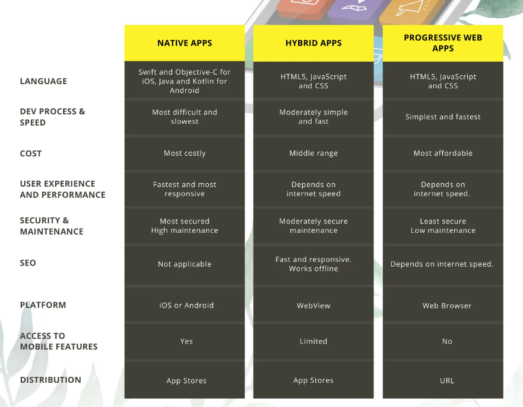

参考资料：https://mp.weixin.qq.com/s/ipOfnfPOsvCaw3258N_CmQ

参考资料：https://makelemonapp.com/beginners-guide-to-apps-native-vs-hybrid-vs-pwa/

## Native App

在 iOS 和安卓中使用开发语言是object-c /swift、java/kotlin开发出来的 App，一般称之为原生App

特点：体验好，性能高，可以提前下载资源到本地，访问速度快，可以访问设备上的所有功能，可直接调用系统摄像头、通讯录、相册、GPS定位、蓝牙等功能，也可以访问到本地资源，功能强大

缺点：①  不支持动态化更新，如果出现线上问题，开发修复了 bug 之后，需要重新发版、提交应用商店审核，并且用户需要重新下载整个App

②  需要兼容旧版本App（现在也有弹窗提示来强制用户更新，不然不让用的操作）

## Hybrid App

俗称的混合App或套壳App，整个 App 还是原生的，也需要下载安装到手机，但是 App 里面打开的页面既可以是 Web 的，又可以是原生的

可访问的系统api有限（例如访问不了相机和本地存储）

要发请求去加载很多资源，无法离线（此点存疑，不能将静态资源css和js啥的一起打包吗）

## Web App

本质就是一个Web网站，在浏览器上打开，不是安装在手机系统桌面的，所以不能拿和上面这两个比，应该是拿PWA和上面两个比较

特点：天然支持跨平台，上线发版简单

缺点：①  只能使用浏览器提供的功能，无法使用手机上的一些功能。比如摄像头、通讯录、相册等等，局限性很大。

②  依赖网络，加载资源速度受到限制；性能比不上原生，比如长列表；

## Progressive Web App

简称PWA，渐进式的Web App，可以看成是增强版的Web App，增强了一些功能，加载快，性能接近Native App（此点存疑），本质也是个网站，但是可以安装到桌面了，和Hybrid App的区别就是不用去套一个app壳子

每个PWA应用可以看成是一个特殊的微型浏览器，有点像把手机系统当成浏览器，一个PWA图标是一个书签

可以推送通知，访问相机、GPS定位等，提供离线支持，这些功能是Service Workers和其它工具实现的，但并不是所有平台都完全支持Service Workers，因此该功能被调低为 iOS 设备的“仅在线”模式；它适用于 Android，但必须先将Chrome 添加为默认浏览器

至于访问权限，也是访问不了相机这些，和Hybrid App一样都只能有限地访问设备功能

运行依托于浏览器提供的WebView（此条存疑）

## 比较

