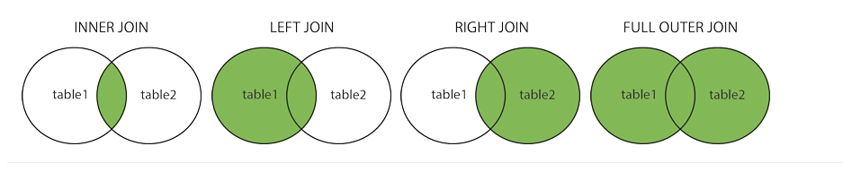

语法：关键字select、create等不区分大小写，结尾必须加分号

## Select

```sql
select country, city as cityName from customers; -- as是别名
select * from customers;
select distinct country from customers; -- 查询后去重
select count(distinct country) from customers; -- 查询去重后的数量，还有avg、sum
select min(price) as smallestPrice from products; -- 查询价格最低的，同理还有max
select top 3 * from customers; -- 查询3条，不是所有数据库都支持，MySQL是用limit
```

## Where

过滤records或提取特定的record

运算符：=、>、<、>=、<=、<>、between、like、in

```sql
select * from customers where country='Mexico';
select * from customers where customerID=1;
```

## And、Or、Not、In

过滤records，可和where搭配使用

```sql
select * from customers where country='Germany' and city='Berlin';
select * from customers where city='Berlin' or city='München';
select * from customers where not country='Germany';
select * from customers where country='Germany' and (city='Berlin' or city='München');
select * from customers where not country='Germany' and not coutry='USA';
```

In是和where搭配来指定一些值，相当于多个or的简写

```sql
select * from customers where city in ('Berlin', 'München');
select * from customers
where country in (select country from suppliers);
```

## Order By

将records进行排序，默认升序

```sql
select column1, column2, ...
from table_name
order by column1, column2, ... asc|desc;
```

## Insert Into

```sql
insert into customers (customername, contactname, address, city, postalcode, country) values ('cardinal', 'tom b. erichsen', 'skagen 21', 'stavanger', '4006', 'norway');
```

## Null Values

如果field是可选的，当没有赋值的时候，默认为null

```sql
select customername, address from customers
where address is null; -- 查询地址为空的
```

## Update

搭配where使用，where指定了哪些records会被修改

```sql
update customers set contactname = 'alfred schmidt', city= 'frankfurt'
where customerID = 1;
```

## Delete

也是搭配where使用，如果省略了where则是删除整个表的数据（但表还在）

## Between

指定数字、文本或日期的范围

```sql
select * from products where Price between 10 and 20;
select * from products where price not between 10 and 20;
select * from products where price between 10 and 20 and categoryid not in (1,2,3);
select * from products where productName not between 'carnarvon tigers' and 'mozzarella di giovanni' order by productName;
select * from orders where orderDate between '2020-01-01' and '2020-12-31'
```

## Like

搭配where来查询指定格式，通配符%代表不限数量的字符，_代表一个字符（MS Access数据库则是分别用*和?代替），还有其它通配符，见https:--www.w3schools.com/sql/sql_wildcards.asp

```sql
select * from customers where customerName like 'a_%';
```

## Joins

基于相同的列进行连表查询

```sql
select orders.orderID, customers.customerName, orders.orderDate
from orders
inner join customers on orders.customerID=customers.customerID; -- inner写不写都一样
```

不同的连表查询类型



## Union

联合其它表，必须有相同的列，列的顺序也要一致，默认是过滤重复值的，如果允许重复值，用union all

```sql
select city from customers
union all
select city from suppliers
order by city;
```

## Group By

通过某个一样的值进行分组，常与count()、max()、min()、sun()、avg()等配合使用，如计算每个country的用户数量

```sql
select count(customerID), country from customers group by country;
```

## Having

因为where不能直接和count()这些aggregate functions一起使用，所以需要有having来辅助

```sql
select count(customerID), country
from customers
group by country
having count(customerID) > 5; -- 过滤出5个客户以上的那些country
```

## Exists

用来测试subquery是否存在record，存在则返回true，查出结果来，不存在则返回false，没有结果

```sql
select supplierName from suppliers
where exists (select productName from products where products.suppliersID = suppliers.suppliersID and price < 20);
-- 列出产品价格有低于20的供应商
```

## Any，All

## Select Into

## Insert Into Select

## Case

## Null Functions

## Stored Procedures

一个stored procedure是一段可重复使用的SQL代码

```sql
create procedure selectAllCustomers @City nvarchar(30)
as
select * from customers where city=@city
go;
-- 用的时候
exec selectAllCustomers @city='London';
```

