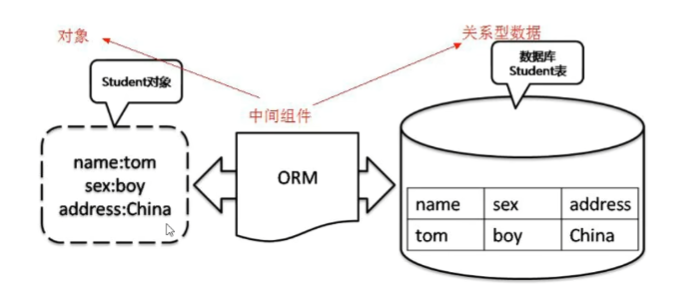
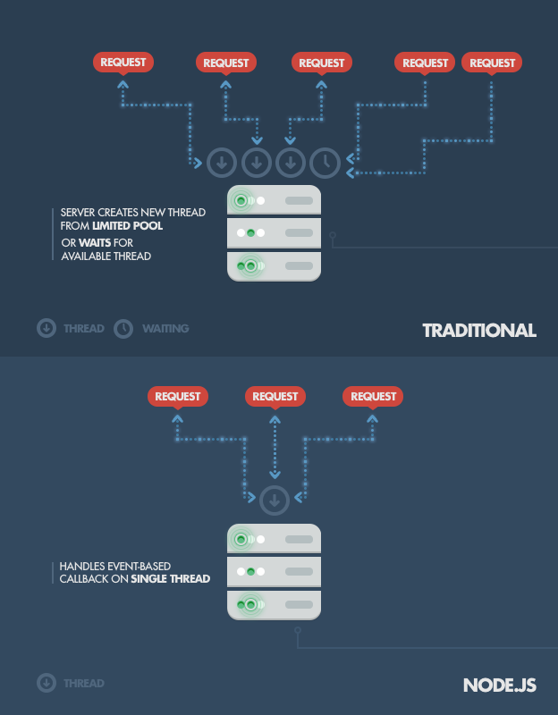
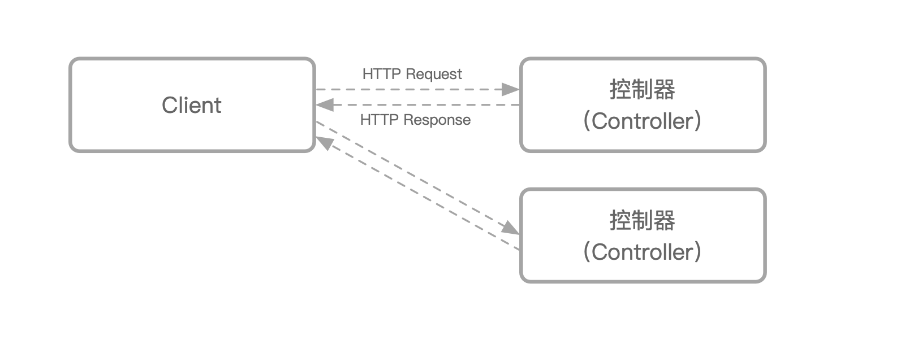
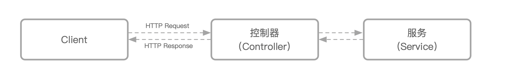
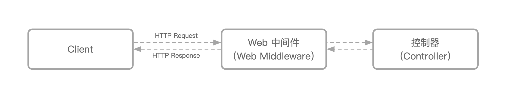
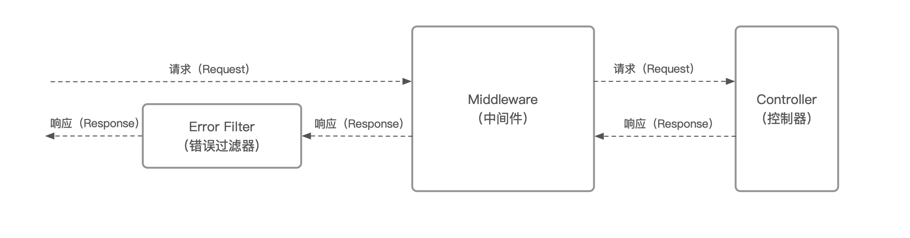

## Spring Boot

后端概念

`jdk`：`java`运行环境，类似于`Node.js`

`pom.xml`：依赖关系文件，类似于`package.json`

`Maven`：项目构建和依赖管理工具，类似于`npm` + `webpack`

`application.properties`：相当于`webpack.config.js`，额外的配置

拦截器：接收请求前做一些操作（权限检查，没登录不让跳到`Controller`），请求处理完成后在返回响应数据前做一些操作，类似`Axios`的拦截器，`Koa`的中间件，可以定义拦截哪些路径或过滤哪些路径

`Spring MVC`：是对`servlet`（控制http请求和响应的程序）的封装

ORM：对象关系映射，为了解决对象与关系数据库不匹配的情况，将对象映射到数据库的一项技术，例如MyBatis（基于JDBC的封装，让访问数据库更方便）

数据库连接池：数据库连接池是管理数据库连接的，当后端程序和数据库建立连接后将连接保存在池中，当有请求来时，直接用这个连接对数据库进行访问，而不用再生成新的连接

`Navicat`：一种数据库管理工具，提供可视化管理页面

## Node.js

可扩展性、延迟和吞吐量是Web服务器的关键性能指标，Node.js通过“非阻塞”方法来处理请求，从而实现低延迟和高吞吐量，换句话说，Node.js不会浪费时间或资源来等待I/O请求返回

传统Web服务器处理请求时会生成一个新的执行线程甚至派生一个新进程来处理，这会产生很大的开销
虽然生成线程比派生进程产生的内存和CPU开销更小，但也是低效的，大量线程的存在会导致系统将宝贵的周期耗费在线程调度和上下文切换上，这样会增加延迟并且限制了可扩展性和吞吐量

特点：适合I/O密集型，不适合CPU密集型应用程序，即它的并发能力强。适合搭配非关系型数据库（如MongoDB），不适合搭配关系型数据库（如MySQL），相较于关系型数据库，非关系型数据库有并发能力和水平扩展能力上的优势

## Node.js相关框架概念

controller：接收前端请求并作出反应，可通过注解获取参数、header等

service：一般`Controller`接收请求后调用`Service`中的方法返回响应数据，主要是为了分层设计

中间件：和拦截器一个意思，在控制器调用之前和之后（部分，Koa可以，Express只能在控制器之前调用）调用的函数，中间件函数可以访问请求和响应对象

异常处理器：负责处理应用程序中所有未处理的异常

守卫：守卫会根据运行时出现的某些条件（例如权限，角色，访问控制列表等）来确定给定的请求是否由路由处理程序处理。

普通的应用程序中，一般会在中间件中处理这些逻辑，但是中间件的逻辑过于通用，同时也无法很优雅的去和路由方法进行结合，因此在中间件之后，进入路由方法之前设计了守卫，可以方便的进行方法鉴权等处理。

守卫会在中间件之后，路由方法之前执行

## Express and MongoDB

在express中，mongodb包和mongoose包区别：mongodb包是驱动文件，用于Node.js与MongoDB数据库交互，mongoose可以看成是基于mongodb包的封装，为访问数据库提供了一些便利性

SPA应用为什么接口需要加前缀baseURL：用于区别是自己维护路由跳转还是调取接口

## 后端架构演变史

简单的后端程序都是打个包部署到服务器上，启动后端程序和数据库，这样就能对外提供访问了

接着发现用户的请求只有少数是业务请求，其余都是请求静态资源如`html`、`css`、`js`、图片等，于是将这些静态资源单独部署到`Nginx`上（可接收并发量高，反向代理业务请求给后端程序）

当访问量上来到一个后端程序有点处理不过来了，于是上集群，部署多个后端程序，由`Nginx`负责转发请求到其它服务上（负载均衡）

过了一段时间，发现轮到数据库扛不住了，于是上数据库读写分离，再架设几台数据库服务器，做主从、分库分表

又过了一段时间，访问量越来越高，而且大部分是查询，于是加上了缓存，把用户高频次访问的数据放到缓存里（相关工具：redis）

后来，项目功能越来越多，项目也愈发庞大，修改一个类就需要全盘上传，切换nginx重启，发布流程越来越长，越来越繁杂，于是开始把模块拆分，用户信息分个项目，订单系统分个项目，这样就达到了用户模块代码修改时只需要更新用户信息服务就好了，这就是微服务，但还是要切换顶层的Nginx，把要重启的服务的流量切到可用服务上

这时可以把所有的服务在启动的时候注册到一个注册机里面，然后顶层处理在接收到Nginx的请求时，去注册机找一个可用的服务并调用接口，这样子呢，在不加新功能的时候，顶层处理服务我们就不需要动了。修改了用户信息项目的时候，我们只需要一个个更新用户信息项目的服务群就好了