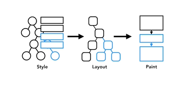
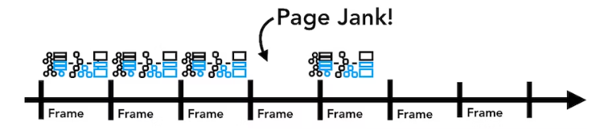
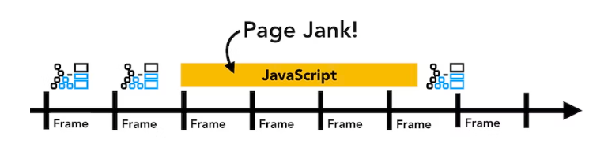
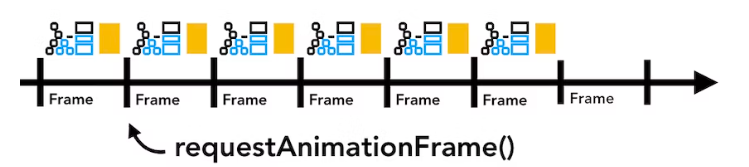
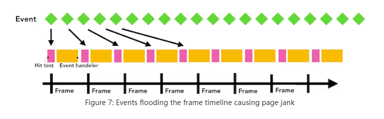
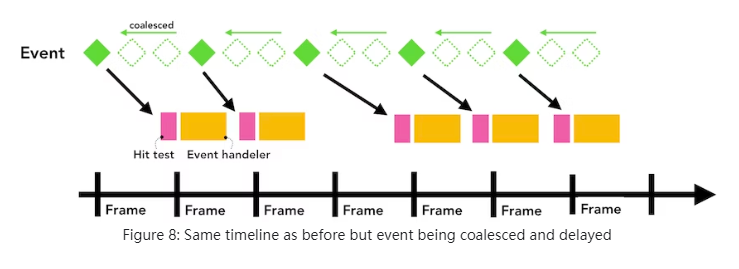

笔记摘抄自[Inside look at modern web browser](https://developer.chrome.com/blog/inside-browser-part1/)

## 当在地址栏输入一个URL

该篇笔记主要涉及到两个进程，browser进程和renderer进程

browser进程包含了UI线程和network线程

renderer进程里包含了main线程（也就是执行js的主线程）、worker线程（处理使用web worker或service worker时的js代码）、compositor合成器线程和raster光栅线程，renderer进程的核心工作就是把html、css和js转化成用户可交互的网页

第一步，UI线程会判断这是一个查询还是一个URL

第二步，UI线程发起一个网络调用（initialte a network call）来获取网站内容，network线程通过合适的协议例如DNS来查找和为请求建立TLS连接

第三步，响应回来之后，如果是一个html文件，则会传递数据给renderer进程。如果是一个zip文件或其它类型文件，说明是一个下载请求，这时候则会把数据传递给下载管理器download manager

注：在传递数据之前，network线程也会询问响应数据是否安全，此时浏览器会进行SafeBrowsing校验，如果域名和响应数据匹配到了已知的恶意站点，network线程会展示一个警告页，另外还会进行CORB（Cross Origin Read Blocking）校验，为了保证敏感的跨域数据不会被传递给rendered进程

第四步，当所有校验都完成，network线程才能确定此时可以让浏览器导航到所请求的站点，于是network线程通知UI线程需要的数据已经准备完毕，UI线程就会寻找一个renderer进程来做页面渲染工作

注：由于网络请求通常需要几百毫秒才响应完成，浏览器会采取一种优化方法来加快这个过程。当UI线程在第二步时发送一个URL请求给network线程，它已经知道它们将会导航到哪个网站，UI线程尝试并行地主动查找或启动一个renderer进程，这样做的话，如果一切进行顺利，那么renderer进程会在network线程接收数据时就已经准备好了

第五步，现在数据和renderer进程已经都准备好了，browser进程会发送IPC和数据流data stream给renderer process去commit navigation。等browser进程确认renderer进程完成commit，那么导航就结束了，此时进入文档加载阶段（the navigation is complete and the document loading phase begins），也就是renderer进程拿着数据准备渲染页面了

第六步，当renderer进程渲染页面完毕，发送IPC告知browser进程（此时页面上所有的onload事件的回调函数都已经执行完成）

## 解析HTML

### 构建DOM

当renderer进程接收到commit navigation信息并且开始接收html数据时，main线程开始解析html文档并构建DOM tree

### 子资源加载

在main线程解析到DOM的过程遇到需要加载其它资源如images、css和js时，main线程会通知browser进程里的network线程去请求

### js会阻塞解析

当html解析器解析到script标签时，会暂停解析，接着去加载、解析和执行js代码，之后再继续解析html文档。原因是js有可能会改变文档结构，例如document.write()。可以使用async或defer来不阻塞html的解析

## 样式计算

main线程解析css并且计算出每个DOM节点的样式

## 布局

renderer进程此时知道了文档结构和每个节点的样式还不足以渲染页面，就像只描述一幅画里有一个大的红色圆圈和一个小的蓝色正方形，并不足以让别人知道这幅画究竟长什么样子

布局layout是一个用来确定元素几何形状和位置的过程，main线程遍历DOM和计算后的样式然后生成一个layout tree，layout tree包含着元素的坐标，盒子边界大小等信息。layout tree和DOM tree结构很相似，但layout tree的节点只包含了有关在页面上怎么显示的信息，如果元素设置为display: none，那这个元素不会出现在layout tree上

## 绘制

有了DOM、样式和布局依然还不能够渲染页面，例如想复制一幅画，知道了尺寸、形状和元素位置，但是仍然无法判断它们的绘制顺序。例如两个位置有重叠而且设置了`z-index`的元素，那么就需要确定它们的绘制顺序。在绘制步骤，main线程遍历layout tree来创建绘制记录paint records，绘制记录是一个绘制过程的注释，例如先背景，然后文本，然后矩形

### update rendering pipeline is costly

如果设置动画让一个元素动起来，浏览器必须在每一帧都执行这些渲染操作（style - layout - paint）

在60帧刷新率的屏幕上，如果某几个帧缺失了渲染操作，这就是丢帧，用户看着会页面卡顿

而这些渲染操作是在主线程上运行的，这意味着当应用程序正在执行js的时候它可能会被阻塞

这种情况可以将对js的操作分割为小的块chunks，通过`requestAnimationFrame()`在每个帧上执行

## 合成

此时浏览器知道文档结构、每个元素的样式、页面的几何形状位置和绘制顺序，浏览器要开始绘制页面了，将这些信息转变成像素展示在屏幕上的过程叫做光栅化rasterizing

在Chrome首次发布时，处理光栅化是只简单地将页面里用户看得到的部分光栅化，用户滚动页面，再继续光栅化填充新的部分。而现代浏览器用一种更复杂的过程称之为合成compositing

合成是一种用一个叫compositor线程的独立线程，将页面分成若干个图层，分别去对它们进行光栅化，然后再组合成一个页面的技术，当用户滚动页面时，由于图层都已经光栅化，所要做的只是合成一个新的帧。动画可以用同样的方式通过移动图层和合成一个新的帧来实现

### 页面分割成图层

为了找出哪些元素应该在哪些图层中，主线程main thread遍历layout tree来生成一个layer tree

### 主线程的光栅和合成

一旦layer tree创建完成并且绘制顺序确定了，主线程commit信息给compositor线程，compositor线程接着对每个层进行光栅化，一个图层可能是一整个页面这么大，所以compositor线程将它们切分成瓦片tiles然后发送给raster光栅器线程，raster线程对每个瓦片tile进行光栅化然后保存到GPU内存里

等所有瓦片tiles都光栅化完毕，compositor线程就收集瓦片tile信息（称为draw quads）来创建一个合成帧compositor frame

tile：就像一个个小的矩形卡片，最后组合起来就是一个完整的图层

draw quads：包含了tile的一些信息，例如瓦片tile在内存中的位置以及考虑到在页面合成过程中在页面哪个位置去画这个瓦片tile

compositor frame：收集draw quads，然后用来表示页面的一帧

一个合成帧compositor frame接着通过IPC提交给browser进程，此时，可以从UI线程中添加另一个合成帧以进行浏览器UI更改。这些合成帧被发送到GPU然后显示在屏幕上。如果出现滚动事件，compositor线程将创建另一个要发送到GPU的合成帧compositor frame

合成的好处是它可以在不影响到main线程的条件下完成，compositor线程是一个独立的线程，而且它不需要等待样式计算或者js执行，这就是为什么composition only animations被认为是兼具顺滑和性能的最佳选择，如果layout或者paint需要重新计算，那么必然会涉及到主线程

## input event

input event输入事件不仅是在输入框里输入文字或者鼠标的点击，在浏览器的视角看来，输入意味着用户的任何手势，鼠标滚动、触摸、鼠标移动都是输入事件

举个例子，当用户触摸屏幕时，最先接收到这一手势的是browser进程，browser进程只关心发生在renderer进程所渲染的内容里的手势，browser进程会将发生事件类型（例如touchstart）和它的坐标给renderer进程，renderer进程通过寻找事件的目标元素（event target）和执行绑定的事件监听器（event listeners）来处理这个事件

### compositor如何接收input event

compositor合成器是通过合成光栅化的图层来让页面滚动时保持顺滑。当没有绑定输入事件监听器的时候，compositor线程可以完全独立于main thread创建一个新的合成帧，而当有绑定输入事件监听器的话，compositor thread如何知道事件是否需要处理

### 理解non-fast srollable region

由于执行js是main线程的工作，当页面合成完成后，compositor线程会标记页面里某个绑定了事件监听器的区域作为“non-fast scrollable region”。有了这个标记，当区域里的事件触发后，compositor线程就可以确定是否要发送输入事件给main线程，而如果input event是发生在这个区域之外，那么compositor线程就可以在不用等待main线程的情况下继续合成新的帧

当写event handles的时候要注意，当你采用事件委托，并且委托元素是body元素，在浏览器的角度看来，这意味着整个页面都是non-fast scrollable region，每当输入事件到来，compositor thread都要去和main thread进行沟通然后等待它，这会破坏合成器对于平滑滚动的处理能力

为了减少这种情况的发生，可以在事件监听器上添加passive: true选项，这是提示浏览器在main线程中仍然可以监听事件，但是合成器也可以接着合成新的帧

### 找到事件目标元素event target

当compositor线程发送一个input event给main线程时，首先是执行一个hit test（命中测试）来找到event target，hit tests使用在rendering进程里生成的paint records来找出事件触发时所在坐标下的内容

### minimizing event dispatches to the main thread

将需要派发到主线程的事件最小化，通常屏幕一秒刷新60次，在触屏设备上触摸事件的刷新率是一秒60-120次，鼠标刷新率是100次，输入事件频率比屏幕刷新率更高

如果一个持续性事件continuous events例如touchmove一秒发送给主线程120次，这会触发过多的hit tests，并且和屏幕刷新率相比，js执行会有多慢

为了减少对主线程的频繁调用，Chrome会在下一个requestAnimationFrame到来之前，将持续性事件continuous events进行聚合然后延迟派发

如果需要中途不丢失坐标信息，例如想画一条线，可以用`getCoalescedEvents()`

而离散型事件discrete events例如keydown，keyup，mouseup，mousedown，touchstart和touchend则会立即派发