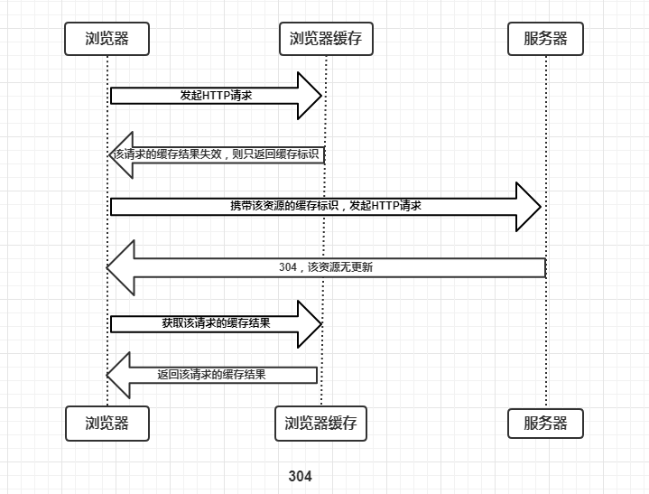
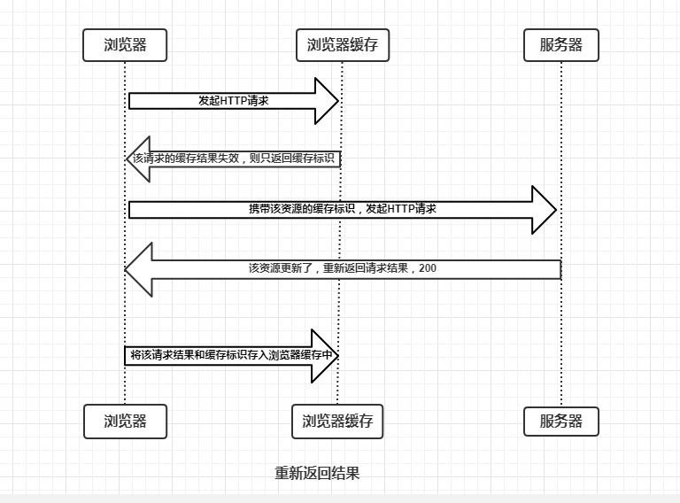

## 浏览器缓存

强制缓存有三种情况：

不存在缓存结果和标识，则说明强制缓存失效或不存在，直接向服务器发起请求

存在缓存结果和标识，但结果失效，携带标识发起请求（协商缓存）

存在缓存结果和标识，未失效，则直接应用缓存

### 强制缓存的缓存规则

控制强制缓存的字段是响应头中的`Expires`和`Cache-Control`，后者优先级更高

`Expires`：http1.0时控制缓存的字段，原理是使用客户端时间与服务端返回的时间做对比，但是客户端和服务端时间可能有误差（例如时区不同），如果客户端时间晚于服务端则资源还未过期就重新请求，反之则资源过期了客户端还在使用，在http1.1被`Cache-Control`取代

`Cache-Control`取值主要为

- public：所有内容都被缓存（客户端和代理服务器都可缓存）
- private：所有内容只有客户端缓存，默认值
- no-cache：客户端缓存内容，但是是协商缓存
- no-store：所有内容都不缓存，每次都请求新的
- max-age=xxx：缓存内容在xxx秒后失效

强制缓存顺序是先内存（from memory cache）后硬盘（from disk cache），内存缓存读取速度快，进程关闭时清空

刷新时、无痕模式是内存缓存，退出重进、大型css、js文件是硬盘缓存，

### 协商缓存

协商缓存的标识有`Last-Modified/If-Modified-Since`和`Etag/If-None-Match`，后者优先级更高

`Last-Modified`：响应头字段，表示返回该资源最后被修改的时间
`If-Modified-Since`：请求头字段，服务器用来与最后被修改时间对比，一致则返回304，同意缓存，不一致则重新返回资源，状态码为200

`Etag`：响应头字段，服务器对该资源的唯一标识
`If-None-Match`：请求头字段，服务器用来与自己保存的`Etag`值作对比

## 内核、渲染引擎、js引擎

内核包括渲染引擎、`js`引擎和其它组件，虽然我们现在习惯单独称呼`js`引擎，但在内核架构图里，`js`引擎始终是包含在内核里的，只不过可以单独拎出来，因为它和内核之间不是集成关系，而是调用关系，所以如果魔改内核的话可以替换成其它`js`引擎

## 关于app内核的讨论

app自带内核的好处：当初微信团队是主动找到X5内核的。原因是安全和可控。安全的原因是如果微信使用系统内核，一旦爆出安卓、chromium的漏洞，将非常被动。很难甚至无法修复。而且如果不是X5统一了标准（虽然之前落后了点），你们要所有机型一个个的适配，甚至包括安卓4.4以前的`webview`。这个工作量远比适配X5高N倍

知乎有条回答：微信6.1版本以上的android用户，都是使用的QQ浏览器的X5内核。5.4-6.1之间的版本，若用户安装了QQ浏览器就是使用的X5内核，若用户未安装浏览器，使用的是系统内核。系统没有qq浏览器就用系统的浏览器，有 qq 浏览器会用 qq 浏览器的内核（但评论里也有人反馈高版本微信依然使用的是系统内核的情况）

还有人回答：在高版本的安卓系统上新版本的微信，之前看过好像也是基于WebView的（当时是看的安卓10）。x5现在只用在兼容低版本系统这个场景

自测手机系统android system webview版本是87，自带浏览器打开https://ie.icoa.cn/网站检测是89，微信浏览器打开是86，说明自带浏览器和微信都是用它们app自带的内核

还有一种检测办法，打开http://soft.imtt.qq.com/browser/tes/feedback.html，显示000000表示加载的是系统内核，显示大于0的数字表示加载了x5内核（数字是x5内核版本号）

## app自带内核和系统WebView

遇到过一个问题：遇到一个跑在企微端的H5项目在Android 9手机上白屏，app版本已经是最新，排查半天是系统内置`WebView`版本过低，只有68，升级系统`WebView`后才解决

原因：企微自带了x5内核，可能是默认禁用掉了app自带内核才会调用系统内置`Webview`来进行渲染加载（google play商店版本的微信默认就是使用系统`WebView`内核，这也是很多人觉得觉得 Play 商店版本的微信体验会比国内版本的微信好的原因之一）

X5 WebView 内核是在APP 第一次初始化时，动态下载到APP 的内部存储空间，因为TBS SDK(Android x5 webview)采用了后台动态下发内核的方案。由于Google Play 禁止任何二进制代码的下发（包括so、dex、jar）和插件化技术的使用，故使用X5 内核的app不支持在海外Google Play上架新版本微信已经从x5内核切换到xweb内核，可以通过`Navigator.userAgent.toLowerCase().includes('xweb')换成xweb`，旧版X5内核是`includes('tbs')`

组里也有人说现在企微自带的x5内核是直接在系统自带`WebView`简单封装了一下（为了减小app体积），运行的时候是调用系统`WebView`在渲染执行，所以系统`WebView`版本低会导致白屏（此条存疑）

## 小程序内核

小程序内核其实就是微信内置的内核，安卓端的还是X5内核，它是基于chromium（blink和v8）的腾讯魔改版，小程序官网不写x5，写的是chromium