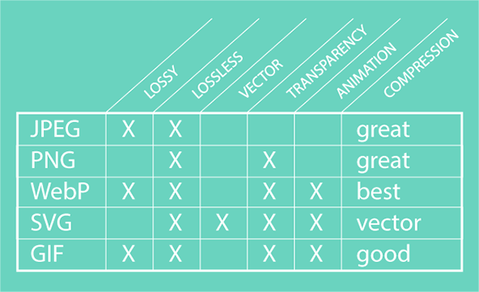
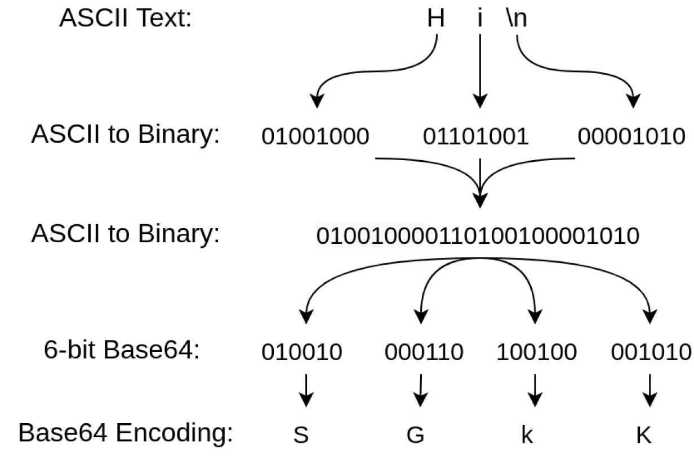

## 光栅图和矢量图

图像格式有两大类：光栅图和矢量图

光栅图：也叫位图，图片是由一个个像素构成，放大会模糊，格式有`.jpg`、`png`、`gif`和`webp`等

矢量图：矢量图通过一系列计算指令来表示的，放大不会模糊，格式有`.svg`

## img标签的intrinsic size和rendered size

`intrinsic size`：图片原有的尺寸，宽高各是多少像素

`rendered size`：图片渲染到屏幕上占的像素

如果是光栅格式的话，`rendered size`越接近`intrinisic size`时，图片越模糊，`rendered size`最大值是`intrinisic size`，达到最大值后再放大相当于直接拉伸，越来越不清晰

如果是矢量格式，`rendered size`可以超过`intrinisic size`，并且清晰度不会受影响

## 各格式特点

jpg：也叫jpeg，采用有损压缩，不支持透明背景

png，采用无损压缩，支持透明背景

gif：采用无损压缩，支持动画，仅支持8位颜色（jpg和png支持24位）

webp：支持无损压缩和有损压缩，文件体积小，支持透明背景，支持动画

svg：文件体积一般比光栅图小，放大不模糊，支持动画

还有一种更新的图片格式：avif，不讨论



## 各格式用法

相同质量下，webp会比jpg和png文件更小，所以能用webp优先用webp，而且webp支持后备(fallback)用png或jpg

gif一般不用于静态图片

在展示图片时，一般svg和webp哪个文件小用哪个，svg多是用在图标中

在上传图片时，由于SVG是一种标记语言，因此它们容易受到恶意软件注入，出于安全考虑一般不允许上传svg格式的图片

一般照片用jpg格式，普通插图和图标用png或svg格式

jpg拥有很高的压缩比，会损失一些图像质量，适合展示color-heavy（理解为色彩丰富）的图片，例如拍摄的照片或个人照片，不适用于low-heavy（色彩少的）的例如屏幕截图，也不适合打印照片，或者一些带有线条、曲线、文本等元素的图片

如果比较关注图像质量而不太关注颜色，可以用png，png即使压缩后也能保持很高的质量，屏幕截图使用png更好，有时照片也会用png格式，因为png在保持图像质量方面更容易预测（Sometimes, they’re used over JPEGs for photography, since PNGs are more predictable in retaining image quality.）

gif用于需要快速显示一段动画，例如简短教程的情况下，作为引入一个短视频的替代品，不适合静态图片

jpg使用有损压缩来保持较小的文件大小。jpg压缩不是全有或全无的设置。可以在 0%（重度压缩）到 100%（无压缩）之间选择合适的压缩率。通常，将图像压缩到 75-100% 之间可以保持图像的完整性和高质量，压缩到 75% 时图像只有原来的一半大。大多数社交网络将其图像压缩在 70-85% 范围内，例如，Facebook 会将您的图片压缩 85%

webp在IE和Safari中不支持，为了兼容性，可以写以下代码

```html
<picture>
  <source srcset="/images/cereal-box.webp" type="image/webp" />
  <source srcset="/images/cereal-box.jp2" type="image/jp2" />
  
</picture>
```

这表示在大多数浏览器中会使用webp格式，Safari中使用jp2，而IE则使用jxr

还可以封装成公共组件

```tsx
const ImgWithFallback = ({
  src,
  fallback,
  type = 'image/webp',
  ...delegated
}) => {
  return (
    <picture>
      <source srcSet={src} type={type} />
      
    </picture>
  );
};
// usage
<ImgWithFallback
  src="/images/cereal.webp"
  fallback="/images/cereal.png"
  alt="A photo showing the expiration date on a box of Lucky Charms"
/>
```

参考资料：https://themeisle.com/blog/best-image-format/#gref
参考资料：https://wpmudev.com/blog/best-image-formats-png-vs-jpg-svg-gif-webp/

图片是如何存储的：https://www.analyticsvidhya.com/blog/2021/03/grayscale-and-rgb-format-for-storing-images/

base64：一种编码算法，能将任何字符转换为由字母、数字、加号和斜杠组成的字母表，可以将汉字、Emoji表情甚至图像转换为"可读"的字符串，可以保存或传输到任何地方。最常用于对二进制数据（例如图像或声音文件）进行编码，输出文本以便嵌入到HTML等文本文档中

base64参考资料：https://www.redhat.com/sysadmin/base64-encoding




