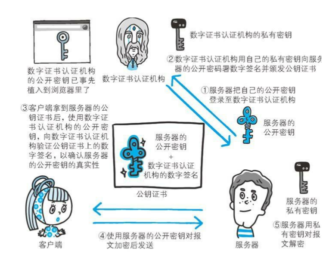

## http1.1

队头阻塞：如果某个请求没成功响应，会阻塞后续请求

低效TCP利用：由于TCP慢启动机制，在一开始传输速率不高，在处理多个请求后才会慢慢提高传输速率，对于请求量小的应用受影响大

消息头臃肿：http1.1消息头无法压缩，比如有cookie的存在，经常出现请求头大小比请求数据还大的情况

无优先级设置：http1.1无法为重要的资源指定优先级，每个http请求都一视同仁

## http2

http2是基于帧的协议，采用分帧方便解析

多路复用：http1.1中如果想发送多个并行的请求，必须使用多个tcp连接，而http2请求和响应都在同一个tcp连接上，http2时代，以往的优化手段：合并资源（如雪碧图，css、js文件合并）和域名分片也不再需要了

域名分片：在http1.1时代，例如chrome浏览器最多只能建立6个tcp链接，而单个tcp连接同一时间只能处理一个http请求，因此将资源拆分向不同子域名请求，使得浏览器能够同时下载更多资源，从而缩短了页面加载时间并改善了用户体验，但这也会造成服务器压力增大、DNS解析域名花费时间、建立tcp连接的开销

## https

`HTTPS`=`HTTP`+`SSL`

① 对称加密：客户端和服务端用同个密钥对数据进行加密或解密 缺点：商量密钥时可能会被窃听

② 非对称加密：服务端拥有一把公钥和一把私钥 第一步：客户端向服务端索要公钥，服务端发送公钥给客户端 第二步：客户端使用公钥进行加密，服务端用私钥进行解密 缺点：服务端无法向客户端发送数据

③ `HTTPS`采用对称加密+非对称加密的机制，商量密钥阶段用非对称加密，通信阶段用对称加密 第一步：客户端向服务端索要公钥，服务端发送公钥给客户端 第二步：客户端定义一个随机数，用公钥加密后发送给服务端，服务端使用私钥解密得到随机数 第三步：随机数作为对称加密的密钥使用 缺点：假如客户端第一次索要公钥的请求就被黑客拦截，此后黑客就能一直当中间人

解决中间人问题的办法是数字证书机构，经过该机构认证过的公钥才是可信赖的公钥，让客户端能够确定公钥是可信赖的服务器发送过来的

## 三次握手和四次挥手

三次握手的过程： 第一次握手：`A`向`B`发起建立连接请求：`A`——>`B` 第二次握手：`B`收到`A`的请求，并且向`A`发送确认信号：`A`<——`B` 第三次握手：`A`收到`B`的确认信号，并向`B`发送确认信号：`A`——>`B` 目的是为了确认双方的收发能力都正常

四次挥手的过程： 第一次挥手：`A`向`B`发起断开连接请求，表示`A`没有数据要发送了：`A`——>`B` 第二次挥手：`B`收到`A`的请求，并且向`A`发送确认信号：`A`<——`B` 第三次挥手：`B`向`A`发送信号，请求断开连接，表示`B`没有数据要发送了：`A`<——`B` 第四次挥手：`A`向`B`发送确认信号，同意断开：`A`——>`B` 第二次挥手和第三次挥手不能合成一次的原因：此时`A`虽然不再发送数据了，但是还可以接收数据，`B`可能还有数据要发送给`A` 挥手次数比握手多一次的原因：在握手过程，通信只需要处理连接。而挥手过程，通信需要处理数据`+`连接

## RPC

早期单机时代，一台电脑上运行多个进程，大家各干各的，老死不相往来。假如A进程需要一个画图的功能，B进程也需要一个画图的功能，程序员就必须为两个进程都写一个画图的功能。这不是整人么？于是就出现了IPC（Inter-process communication，单机中运行的进程之间的相互通信）。OK，现在A既然有了画图的功能，B就调用A进程上的画图功能好了，程序员终于可以偷下懒了。

到了网络时代，大家的电脑都连起来了。以前程序只能调用自己电脑上的进程，能不能调用其他机器上的进程呢？于是就程序员就把IPC扩展到网络上，这就是RPC（远程过程调用）了。现在不仅单机上的进程可以相互通信，多机器中的进程也可以相互通信了。

要知道实现RPC很麻烦呀，什么多线程、什么Socket、什么I/O，都是让咱们普通程序员很头疼的事情。于是就有牛人开发出RPC框架（比如，CORBA、RMI、Web Services、RESTful Web Services等等）。OK，现在可以定义RPC框架的概念了。简单点讲，RPC框架就是可以让程序员来调用远程进程上的代码一套工具。有了RPC框架，咱程序员就轻松很多了，终于可以逃离多线程、Socket、I/O的苦海了

RPC是一种设计，就是为了解决不同服务程序之间的调用问题，完整的 RPC 实现一般会包含有传输协议 和 序列化协议这两个

而 HTTP 是一种传输协议，RPC 框架完全可以使用 HTTP 作为传输协议，也可以直接使用 TCP，使用不同的协议一般也是为了适应不同的场景，所以RPC不是用来和HTTP比较的

使用 TCP 和使用 HTTP 各有优势：

传输效率：TCP，通常自定义上层协议，可以让请求报文体积更小，HTTP：如果是基于HTTP 1.1 的协议，请求中会包含很多无用的内容

性能消耗：主要在于序列化和反序列化的耗时，TCP可以基于各种序列化框架进行，效率比较高，而HTTP大部分是通过 JSON来实现的，字节大小和序列化耗时都要更消耗性能

跨平台：TCP通常要求客户端和服务器为统一平台，HTTP则可以在各种异构系统上运行

总结：RPC 的 TCP 方式主要用于公司内部的服务调用，性能消耗低，传输效率高。HTTP主要用于对外的异构环境，浏览器接口调用，APP接口调用，第三方接口调用等

## 协议

协议是一组规则，可以理解成是那个层提供的服务，在传输层时如果数据包采用`tcp`协议，则表示需要确保数据完整送达的服务，采用`udp`协议则表示你帮我把数据包发出去就行，不管服务端收不收得到

## 分层

计算机网络的分层结构，上层调用下层提供的服务而不关心它的具体实现

应用层：提供特定于应用程序的协议，`http`、`ftp`、`imap`等

传输层：发送数据包到计算机上特定端口号的应用程序

网络层：使用`ip`地址将数据包发送到特定的计算机

链路层：将二进制数据包与网络信号（网线的电信号、wifi的电磁波、光纤的光信号）相互之间转换

## 网络安全

网络传输没有绝对安全的概念，例如用了`https`也不一定安全，计算机网络的攻与防是道高一尺魔高一丈的演进，一切所做的安全手段是为了提高破坏者的操作成本和攻击门槛

服务端的意义是为了保证能给正常请求服务端的用户以正确响应，因此个人认为服务端怎么提高被攻击的门槛，过滤不合理的请求等也属于网络安全范畴

### MD5

`MD5`不是一种加密，因为它是不可逆的

### DDos

`DDos`：采用分布式设备，发起大量请求搞垮服务器
