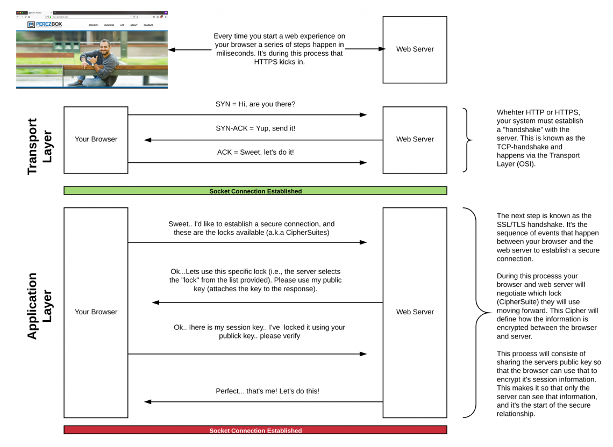

## http1.1

解决了http1.0不能保持连接的缺点

队头阻塞：如果某个请求没成功响应，会阻塞后续请求

低效TCP利用：由于TCP慢启动机制，在一开始传输速率不高，在处理多个请求后才会慢慢提高传输速率，对于请求量小的应用受影响大

消息头臃肿：http1.1消息头无法压缩，比如有cookie的存在，经常出现请求头大小比请求数据还大的情况

无优先级设置：http1.1无法为重要的资源指定优先级，每个http请求都一视同仁

## http2

http2是基于帧的协议，采用分帧方便解析

多路复用：http1.1中如果想发送多个并行的请求，必须使用多个tcp连接（chrome限制同个源最多只能有六个），而http2请求和响应都在同一个tcp连接上，http2时代，以往的优化手段：合并资源（如雪碧图，css、js文件合并）和域名分片也不再需要了

域名分片：在http1.1时代，例如chrome浏览器最多只能建立6个tcp链接，而单个tcp连接同一时间只能处理一个http请求，因此将资源拆分向不同子域名请求，使得浏览器能够同时下载更多资源，从而缩短了页面加载时间并改善了用户体验，但这也会造成服务器压力增大、DNS解析域名花费时间、建立tcp连接的开销

## https

`HTTPS`=`HTTP`+`SSL`

① 对称加密：客户端和服务端用同个密钥对数据进行加密或解密。缺点：商量密钥时可能会被窃听

② 非对称加密：服务端拥有一把公钥和一把私钥 第一步：客户端向服务端索要公钥，服务端发送公钥给客户端 第二步：客户端使用公钥进行加密，服务端用私钥进行解密。缺点：服务端无法向客户端发送数据

③ `HTTPS`采用对称加密+非对称加密的机制，商量密钥阶段用非对称加密，通信阶段用对称加密 第一步：客户端向服务端索要公钥，服务端发送公钥给客户端 第二步：客户端定义一个随机数，用公钥加密后发送给服务端，服务端使用私钥解密得到随机数 第三步：随机数作为对称加密的密钥使用。缺点：假如客户端第一次索要公钥的请求就被黑客拦截，此后黑客就能一直当中间人

解决中间人问题的办法是数字证书机构，经过该机构认证过的公钥才是可信赖的公钥，让客户端能够确定公钥是可信赖的服务器发送过来的

`HTTPS`建立握手过程：首先依然是建立`TCP`连接，这部分与`HTTP`相同，比`HTTP`多了个`TLS/SSL`握手过程，具体是`Client`发送一个建立安全连接的请求，`Server`返回证书（证书中包含公钥）以及一些交换秘钥的信息，`Client`收到`Server`返回信息接着校验证书，一旦`Client`确认`SSL`证书有效，就会发送回一些数据来完成`Diffie-Hellman key exchange`，安全连接建立完成
`Diffie-Hellman key exchange`：在整个建立安全连接的过程中，并没有发送实际秘钥，而是通过双方发送的信息生成相同的秘钥

## 三次握手和四次挥手

所谓的三次握手和四次挥手是指TCP建立连接和断开连接，所需必要逻辑的最简实现

三次握手的过程： 第一次握手：`A`向`B`发起建立连接请求：`A`——>`B` 第二次握手：`B`收到`A`的请求，并且向`A`发送确认信号：`A`<——`B` 第三次握手：`A`收到`B`的确认信号，并向`B`发送确认信号：`A`——>`B` 目的是为了确认双方的收发能力都正常

三次握手细节：`A`发送带有`syn`参数的数据包，`B`能返回带有`ack`参数（值等于`A`的`syn`参数值加1）的数据包，这样`A`收到后就能确定`B`能接收请求，而`B`在返回带有`ack`参数的数据包时，也返回一个自己的`syn`参数，让`A`同样返回一个带`ack`参数（值是`B`的`syn`参数加1）的数据包，那么`B`就也能确定`A`能够正确接收请求，于是开始通信

四次挥手的过程： 第一次挥手：`A`向`B`发起断开连接请求，表示`A`没有数据要发送了：`A`——>`B` 第二次挥手：`B`收到`A`的请求，并且向`A`发送确认信号：`A`<——`B` 第三次挥手：`B`向`A`发送信号，请求断开连接，表示`B`没有数据要发送了：`A`<——`B` 第四次挥手：`A`向`B`发送确认信号，同意断开：`A`——>`B` 第二次挥手和第三次挥手不能合成一次的原因：此时`A`虽然不再发送数据了，但是还可以接收数据，`B`可能还有数据要发送给`A` 挥手次数比握手多一次的原因：在握手过程，通信只需要处理连接。而挥手过程，通信需要处理数据`+`连接

第三次握手数据包丢失会怎么样：第二次握手收到`syn`确认报文后，客户端进入`established`状态，第三次握手丢失，服务端收不到确认报文，将会触发超时重传机制，超过一定时间重新发起第二次握手

## RPC

早期单机时代，一台电脑上运行多个进程，大家各干各的，老死不相往来。假如A进程需要一个画图的功能，B进程也需要一个画图的功能，程序员就必须为两个进程都写一个画图的功能。这不是整人么？于是就出现了IPC（Inter-process communication，单机中运行的进程之间的相互通信）。OK，现在A既然有了画图的功能，B就调用A进程上的画图功能好了，程序员终于可以偷下懒了。

到了网络时代，大家的电脑都连起来了。以前程序只能调用自己电脑上的进程，能不能调用其他机器上的进程呢？于是就程序员就把IPC扩展到网络上，这就是RPC（远程过程调用）了。现在不仅单机上的进程可以相互通信，多机器中的进程也可以相互通信了。

要知道实现RPC很麻烦呀，什么多线程、什么Socket、什么I/O，都是让咱们普通程序员很头疼的事情。于是就有牛人开发出RPC框架（比如，CORBA、RMI、Web Services、RESTful Web Services等等）。OK，现在可以定义RPC框架的概念了。简单点讲，RPC框架就是可以让程序员来调用远程进程上的代码一套工具。有了RPC框架，咱程序员就轻松很多了，终于可以逃离多线程、Socket、I/O的苦海了

RPC是一种设计，就是为了解决不同服务程序之间的调用问题，完整的 RPC 实现一般会包含有传输协议 和 序列化协议这两个

而 HTTP 是一种传输协议，RPC 框架完全可以使用 HTTP 作为传输协议，也可以直接使用 TCP，使用不同的协议一般也是为了适应不同的场景，所以RPC不是用来和HTTP比较的

使用 TCP 和使用 HTTP 各有优势：

传输效率：TCP，通常自定义上层协议，可以让请求报文体积更小，HTTP：如果是基于HTTP 1.1 的协议，请求中会包含很多无用的内容

性能消耗：主要在于序列化和反序列化的耗时，TCP可以基于各种序列化框架进行，效率比较高，而HTTP大部分是通过 JSON来实现的，字节大小和序列化耗时都要更消耗性能

跨平台：TCP通常要求客户端和服务器为统一平台，HTTP则可以在各种异构系统上运行

总结：RPC 的 TCP 方式主要用于公司内部的服务调用，性能消耗低，传输效率高。HTTP主要用于对外的异构环境，浏览器接口调用，APP接口调用，第三方接口调用等

## 通信

不同端系统上的通信，进行通信的实际上是进程而不是应用程序，不同端系统上的进程通过网络交换报文来通信

进程通过一个称为套接字（socket）的软件接口在网络上发送和接收报文

最终的传输是大量0和1集合的数据在媒介上传输（光缆、电缆、电磁波等媒介）

规则：一套规则，限定双方组织数据和解析数据的行为来达到某种目的

## GET和POST

GET和POST本质并无区别，拿一般博客举的几点区别来说

HTTP的RFC规范中GET是安全且幂等的，安全是不修改服务端数据，幂等是调用多次返回结果一致，GET一般是获取资源，POST是提交某个操作（新建修改删除）或上传文件，但这只是规范带来的约定俗成的东西，并不是强制要遵守

GET参数是携带在URL上的，POST参数是放在body里，但这也是通俗约定，GET参数也可以放body，POST参数也可以放URL上，如果浏览器和服务端支持的话

POST相对GET更安全：理由说的是GET请求参数放在URL上，记录会存储在服务器日志或浏览器访问记录里，而POST参数不会被存储。这点要说明的是现在常规JS发起GET请求不会存储在浏览器访问记录里，而后端日志这东西假如能给攻击者访问到的话，还分什么GET和POST请求。我觉得GET请求和POST请求安全级别是一样的，因为HTTPS也会对URL加密，而不用HTTPS的话都不安全

GET请求可以做缓存：其实POST请求也可以做缓存，但是要浏览器支持

GET发送请求一次，POST要发两次，先发请求头数据，得到正确响应后才发送正式数据，但体验在网络通畅的时候几乎没有区别

URL有字符限制：常规浏览器都支持几千个字符，正常业务请求根本到不了这个限制

GET只支持字符串类型：query string是字符串，但现在通过序列化工具能正常支持其它类型，后端也能正常解析到

## 分层

计算机网络的分层结构，上层调用下层提供的服务而不关心它的具体实现

一个数据包需要经过  组织数据 => 确认端口 => 负责寻找ip地址，寻找合适路线 => 负责寻找mac地址 => 开始传输

应用层：负责定义了不同端系统上的应用程序进程如何传递报文，组织和解析

传输层：提供传输服务，发送数据包到计算机上特定**端口号**的应用程序，传输层协议为运行在不同主机上的应用进程之间提供了逻辑通信而非物理通信，运输过程中的设备，例如路由器等最高仅作用于该数据报的网络层字段，不会检查封装在该数据报的传输层报文段的字段，只有接收方会处理

网络层：寻找去目标机器（**ip地址**）的路线，传输层为运行在不同主机上的进程之间提供了逻辑通信，而网络层则提供了主机之间的逻辑通信

链路层：将二进制数据包与网络信号（网线的电信号、wifi的电磁波、光纤的光信号）相互之间转换

注1：逻辑通信：看起来像有实际的一条传输数据的路连接着两个端一样

注2：数据在网络的层层转发中，源IP和目标IP是不会变，变化的只有MAC地址，标识此时正在进行传输的两个设备

注3：TCP协议为了确保数据安全稳定传输，会有各种机制应对传输过程中的各种异常场景，所谓的面向字节流也是因为要达到安全稳定的传输目的才弄成字节流

## 网络安全

SSL：安全套接字层，加强版的TCP，通供进程到进程的安全性服务，但是这种加强是在应用层上实现的

网络传输没有绝对安全的概念，例如用了`https`也不一定安全，计算机网络的攻与防是道高一尺魔高一丈的演进，一切所做的安全手段是为了提高破坏者的操作成本和攻击门槛

服务端的意义是为了保证能给正常请求服务端的用户以正确响应，因此个人认为服务端怎么提高被攻击的门槛，过滤不合理的请求等也属于网络安全范畴

为什么有了`HTTPS`也不一定安全：例如有钓鱼网站的存在，`HTTPS`的锁头标志在`URL`左边，仅仅表示你和这个`URL`之间的数据传输不会被窥探到，但是`HTTPS`的证书是很容易获得的，证书并不能说明网站是你想要的官网，如果一个用了`HTTPS`的钓鱼网站伪装成官网，那你在这个钓鱼网站输入的密码依然会被窃取的

### MD5

`MD5`不是一种加密，因为它是不可逆的，用了`https`就没必要用`MD5`了，前端加密没有多大意义

### DDos

`DDos`：采用分布式设备，发起大量请求搞垮服务器

## 实时通信

参考资料：https://www.pubnub.com/blog/http-long-polling/

普通轮询：`original polling`或`standrad polling`，每间隔一段时间发送一个请求查询服务器最新数据（`setTimeout`或`setInterval`），由于浏览器反复询问服务器，而服务器也立即进行响应，如果数据没有更新，那么响应是没有意义的。而浏览器间隔发送的时间决定着页面更新的频率，时间过长意味着重要的更新没有及时加载，时间过短会有很多无意义响应，导致资源浪费，效率也低下。很多情况下，很难为所有用户统一定义一个完美的间隔时间，请求总是过于频繁或过于滞后，随着用户增多，无意义的响应请求会造成服务器被请求轰炸，甚至堪比`DDos`攻击

长轮询：`long polling`，实时通信的早期例子是基于网络的聊天室和简单的游戏，这些应用程序需要反复轮询服务器以检查新数据，因为服务器无法在新数据更新时主动通知用户，于是开始出现了更多应对实时通信方法，其中最流行的就是长轮询，长轮询是伪实时的。浏览器发送给服务端请求后，服务端不关闭连接，保持连接直到服务端返回响应浏览器等待服务端返回响应，当数据更新了，服务端立马返回数据给客户端客户端收到响应后立即再发送一个长轮询请求给服务端

长轮询的优点：相比较普通轮询，浏览器总是接收到最新的数据，服务端不会被请求轰炸

长轮询的弊端：为了维持客户端的会话状态，必须在服务器集群中共享这个会话状态，或者客户端的后续请求必须转发到与第一个请求相同的服务器进行处理，但这样也会影响负载均衡的效率

长轮询能保持多久：任何客户端与服务器的连接最终都会超时，服务器在返回响应前能保持连接多长时间取决于几个主要因素：服务器对协议的实现，服务器架构，客户端请求头（特别是connection: keep-alive），以及启动和维护连接过程中用到的库，一般是100-300秒

`WebSocket`和`WebRTC`：在长轮询这种传统技术出现多年后才出现的实时通信标准，实现了真正的实时通信

总结：轮询（普通轮询或长轮询）在客户端拥有更高的支持性，`WebSocket`等实时通信标准可能在某些网络上的代理或路由中被阻止，而如果有些服务器不支持长轮询（更不用说其它更现代的实时通信标准）的情况下，仍然需要用到普通轮询（可以是2秒内每隔500ms发送一次请求，2秒后中止，而不是一直轮询），有必要的话也可以通过JSONP

